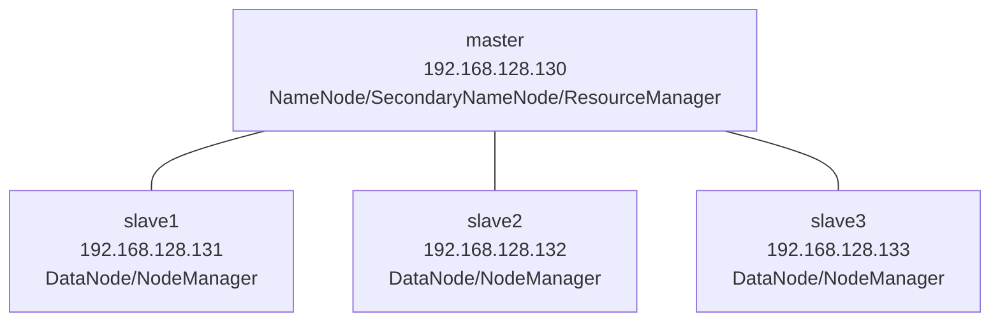

# Hadoop集群的搭建及配置1-安装及配置虚拟机

## 📋 项目概述

本文档将指导您在虚拟机环境中搭建Hadoop完全分布式集群，包含1个主节点（master）和3个从节点（slave1、slave2、slave3）。

## 🎯 学习目标

- 掌握Linux虚拟机的安装与配置
- 理解Hadoop集群架构
- 完成完全分布式集群的搭建和配置
- 学会集群的启动、监控和管理

## 📊 集群架构图

本指南将搭建一个包含 1 个主节点和 3 个从节点的完全分布式集群，其架构如下所示。



- **master 节点**：作为主节点，运行 NameNode、ResourceManager、SecondaryNameNode 和 JobHistoryServer 等核心服务。
- **slave1、slave2、slave3 节点**：作为从节点，运行 DataNode 和 NodeManager 等服务。

## 🛠️ 环境准备

### 硬件要求

- 内存 ≥ 8GB
- 硬盘 ≥ 100GB
- CPU ≥ Intel i5 多核（推荐 8 核）

### 软件清单（需要可私）

| 软件     | 版本       | 安装包                                      | 说明           |
| -------- | ---------- | ------------------------------------------- | -------------- |
| Linux OS | CentOS 7.8 | CentOS-7-x86_64-DVD-2003.iso                | 64位操作系统   |
| JDK      | 1.8+       | jdk-8u281-linux-x64.rpm                     | Java开发环境   |
| VMware   | 15+        | VMware-workstation-full-15.5.7-17171714.exe | 虚拟机软件     |
| Hadoop   | 3.1.4      | hadoop-3.1.4.tar.gz                         | 大数据处理框架 |
| SSH工具  | Xshell 8   | Xme8.exe                                    | 远程连接工具   |

## 🔧 第一步：创建 Master 虚拟机

### 步骤1： 安装 VMware & 新建虚拟机

1. #### **安装 VMware Workstation**：

   双击下载的 `VMware-workstation-full-15.5.7-17171714.exe` 安装包，点下一步，选择安装目录，输入产品序列号即可完成安装.

   

2. #### **创建新的虚拟机**：

   - 打开 VMware 软件，选择 **“创建新的虚拟机”** 选项 。

     

   - 在“新建虚拟机向导”中，选择 **“典型(推荐)”** 模式，然后单击 **“下一步”** 。

     

   - 选择 **“稍后安装操作系统”**，然后单击 **“下一步”** 。

     

   - 选择客户机操作系统为 **“Linux”**，版本为 **“CentOS 7 64 位”**，然后单击 **“下一步”** 。

     

   - 将虚拟机命名为 `master`，并指定一个存放位置，例如 `E:\VMware\master` 。

     

   - 指定最大磁盘容量为 **20GB**，并选择 **“将虚拟磁盘拆分成多个文件”** 。

     

   - 在“准备创建虚拟机”界面，单击 **“自定义硬件”** 。

     

   - 在硬件设置中，选择 **“新CD/DVD”**，在右侧选择 **“使用 ISO 映像文件”**，然后浏览找到 `CentOS-7-x86_64-DVD-2003.iso` 镜像文件 。，然后单击 **“关闭”**  **“完成”** 。

     

   

### 步骤2：CentOS 7系统安装

1. 在 VMware 主界面，选择新建的 `master` 虚拟机，单击 **“开启此虚拟机”** 。

  

2. 在安装界面中，选择 **“Install CentOS 7”** 。

  

3. 语言选择「English（United States）」

  

4. 进入安装页面后，进行以下配置:

  - 配置「DATE & TIME」为「Asia/Shanghai」。

    

    

  - 「INSTALLATION DESTINATION」保持默认自动分区，点击「Done」。

    

    

  - 「NETWORK & HOST NAME」设置主机名为`master`，点击 **“Begin Installation”** 开始安装。

    

  - **ROOT 密码**：设置密码（例如 `123456`），需要输入两次。

    

5. 安装完成后单击 **“Reboot”** 重启.

  


## 🔧 第二步：配置固定 IP

1. 登录 master 节点（用户名`root`，密码`123456`）。

  

2. 重启网卡服务

  ```bash
  service network restart
  ```

  

3. 修改网络配置文件：

  ```bash
  # 编辑网络配置文件
  vi /etc/sysconfig/network-scripts/ifcfg-ens33
  ```

4. 将 `ONBOOT` 的值改为 **`yes`**，将 `BOOTPROTO` 的值改为 **`static`**.

5. 添加 `IPADDR`（例如 192.168.128.130）、`NETMASK`、`GATEWAY` 和 `DNS1` 等配置信息.

  ```ini
  ONBOOT=yes			# 开机启动网络
  BOOTPROTO=static	 # 改为静态IP
  # 新增静态IP配置
  IPADDR=192.168.128.130  # Master节点IP（固定）
  NETMASK=255.255.255.0   # 子网掩码
  GATEWAY=192.168.128.2   # 网关地址（与VMnet8一致）
  DNS1=8.8.8.8           # 谷歌DNS服务器
  DNS2=114.114.114.114   # 国内备用DNS
  ```

  

6. 再次重启网络服务：

  ```bash
  service network restart
  ```

7. 验证 IP：

  ```bash
  ip addr  # 确认显示192.168.128.130
  ```

  


## 🔧 第三步：配置远程连接（Xshell）

1. ### 安装 Xshell：双击`Xme8.exe`，按提示完成安装。

2. ### 配置 VMware 虚拟网络：

   - VMware → 点击「编辑」→「虚拟网络编辑器」，选择 VMnet8，子网 IP 设置为`192.168.128.0`。

   

3. ### Xshell 连接 master虚拟机：

   - 打开 **Xshell** → 新建会话，名称为`master`，主机填写`192.168.128.130`。
   - 「用户身份验证」输入用户名`root`和密码`123456`，点击连接并接受密钥。

   
   
   


## 🔧 第四步：配置 YUM 源 & 安装常用软件

1. 进入 YUM 配置目录：

   ```bash
   cd /etc/yum.repos.d
   ```

2. 禁用默认源：

   ```bash
   #除CentOS-Media.repo之外禁用（加上“.bak”后缀）
   mv CentOS-Base.repo CentOS-Base.repo.bak
   mv CentOS-Debuginfo.repo CentOS-Debuginfo.repo.bak
   mv CentOS-fasttrack.repo CentOS-fasttrack.repo.bak
   mv CentOS-Vault.repo CentOS-Vault.repo.bak
   mv CentOS-CR.repo CentOS-CR.repo.bak
   mv CentOS-Sources.repo CentOS-Sources.repo.bak
   mv CentOS-x86_64-kernel.repo CentOS-x86_64-kernel.repo.bak
   ```

   

3. 编辑本地源配置：

   ```bash
   vi CentOS-Media.repo
   ```

   修改为：

   ```ini
   baseurl=file:///media
   gpgcheck=0
   enabled=1
   ```

   

4. 挂载 ISO 镜像：

   ```bash
   mount /dev/sr0 /media  # 若失败，检查虚拟机CD/DVD是否勾选「已连接」
   ```

   

5. 清理缓存并安装必要软件：

   ```bash
   yum clean all	
   yum install -y vim zip openssh-server openssh-clients  # 安装常用工具
   ```

   

## 🛡️ 常见问题与解决方案

### 问题1：虚拟机无法联网

**症状**：ping命令无法访问外部网站

**解决方案**：

```bash
# 检查网络服务状态
systemctl status network

# 重启网络服务
systemctl restart network

# 检查IP配置
ip addr show

# 测试网络连接
ping www.baidu.com
ping 192.168.128.2  # 测试网关连通性
```

### 问题2. ISO 挂载失败

**症状**：


**解决方案**：右键点击master→设置→确认虚拟机设置中 **CD/DVD 驱动器已勾选“已连接”**。


### 问题3：YUM安装软件失败

**症状**：yum install命令报错

**解决方案**：

```bash
# 检查挂载状态
df -h | grep media

# 重新挂载光盘
umount /media
mount /dev/sr0 /media

# 检查YUM配置
cat /etc/yum.repos.d/CentOS-Media.repo

yum clean all	# 清理YUM缓存
yum makecache	# 重建缓存
```

### （三）SSH 免密码登录失败

1. **问题现象**：执行 “ssh slave1” 时，提示 “Permission denied (publickey,gssapi-keyex,gssapi-with-mic,password)”。

2. 解决方案：

   - 检查 master 节点公钥是否已复制到从节点：`cat /root/.ssh/authorized_keys`（从节点），查看是否包含 master 节点的 id_rsa.pub 内容。
   - 若未包含，重新执行 “ssh-copy-id slave1” 复制公钥。
   - 检查从节点.ssh 目录权限：`chmod 700 /root/.ssh`，`chmod 600 /root/.ssh/authorized_keys`（权限不足会导致公钥无法生效）。

   ```
   # 检查SSH服务状态
   systemctl status sshd
   
   # 启动SSH服务
   systemctl start sshd
   systemctl enable sshd
   ```

   

## ✅ 验证清单

-  Master 虚拟机能成功开机并进入 CentOS。
-  IP 固定为 192.168.128.130。
-  可以通过 Xshell 远程连接。
-  YUM 源可用，能正常安装软件。

## 🎯 下一步操作指南

完成Master节点配置后，可继续进行Java环境安装、Hadoop集群配置、克隆虚拟机、SSH免密登录、配置时间同步、启动和监控集群等。

## 📝 总结

本任务完成了 **虚拟机创建、操作系统安装、固定 IP 配置、远程连接、YUM 源配置与软件安装**，为后续 Hadoop 分布式集群搭建打下基础。

搭建过程中，网络配置和环境一致性是关键，建议严格按照步骤操作，并通过验证清单确保每一步正确完成。

记住，实践是最好的学习方式，多动手操作，多思考问题，您将快速掌握Hadoop技术栈。

## 📚 参考资源

- [Apache Hadoop官方文档](https://hadoop.apache.org/docs/)
- [CentOS 7网络配置指南](https://www.centos.org/docs/)
- [VMware虚拟网络配置](https://docs.vmware.com/)

## 📞 技术支持

如果在配置过程中遇到问题，建议：

1. 仔细检查每个配置步骤
2. 查看系统日志文件：`/var/log/messages`
3. 使用本文档的故障排查部分
4. 参考官方文档和社区资源