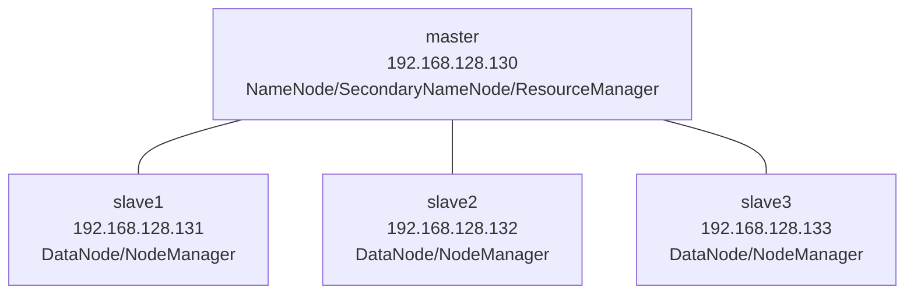
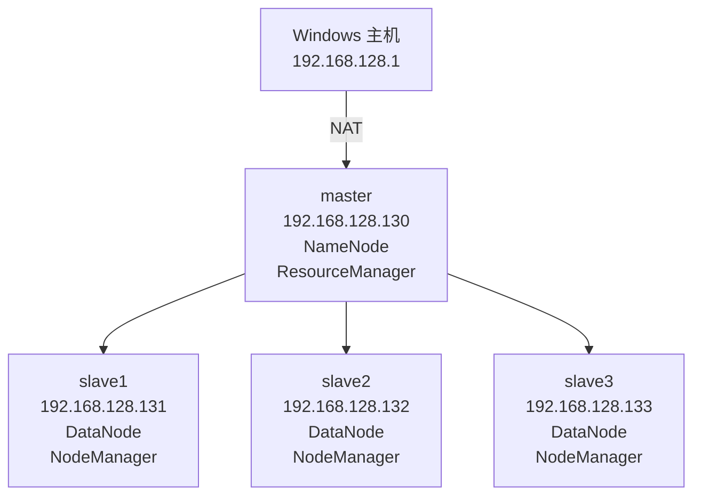
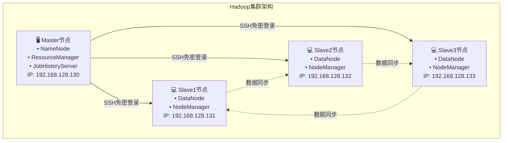

# Hadoop集群的搭建及配置-任务1安装及配置虚拟机


## 📊 集群架构图








## 🛠️ 环境准备

### 硬件要求
| 组件 | 最低配置 | 推荐配置 |
|------|----------|----------|
| 内存 | 8GB | 16GB+ |
| 硬盘 | 100GB可用空间 | 200GB+ |
| CPU | Intel i5 | Intel i7+ (8核) |

### 软件清单（需要可私）
| 软件 | 版本 | 安装包 | 说明 |
|------|------|--------|------|
| Linux OS | CentOS 7.8 | CentOS-7-x86_64-DVD-2003.iso | 64位操作系统 |
| JDK | 1.8+ | jdk-8u281-linux-x64.rpm | Java开发环境 |
| VMware | 15+ | VMware-workstation-full-15.5.7-17171714.exe | 虚拟机软件 |
| Hadoop | 3.1.4 | hadoop-3.1.4.tar.gz | 大数据处理框架 |
| SSH工具 | Xshell 8 | Xme8.exe | 远程连接工具 |


## 🔧 第一部分：虚拟机安装与配置

### 1.1 创建Master虚拟机

#### **步骤一：安装和配置 Linux 虚拟机**

1. 

   **安装 VMware Workstation**：双击下载的 `VMware-workstation-full-15.5.7-17171714.exe` 安装包，点下一步，选择安装目录，输入产品序列号即可完成安装.

   

   

2. **创建新的虚拟机**：

   - 打开 VMware 软件，选择 

     **“创建新的虚拟机”** 选项 。

     

   - 在“新建虚拟机向导”中，选择 

     **“典型(推荐)”** 模式，然后单击 **“下一步”** 。

     

   - 选择 

     **“稍后安装操作系统”**，然后单击 **“下一步”** 。

     

   - 选择客户机操作系统为 

     **“Linux”**，版本为 **“CentOS 7 64 位”**，然后单击 **“下一步”** 。

     

   - 将虚拟机命名为 

     `master`，并指定一个存放位置，例如 `E:\VMware\master` 。

     

   - 指定最大磁盘容量为 

     **20GB**，并选择 **“将虚拟磁盘拆分成多个文件”** 。

     

   - 在“准备创建虚拟机”界面，单击 

     **“自定义硬件”** 。

     

   - 在硬件设置中，选择 

     **“新CD/DVD”**，在右侧选择 **“使用 ISO 映像文件”**，然后浏览找到 `CentOS-7-x86_64-DVD-2003.iso` 镜像文件 。，然后单击 **“关闭”**  **“完成”** 。

     

   ```bash
   # 虚拟机配置参数
   名称: master
   内存: 2GB
   硬盘: 20GB (拆分存储)
   网络: NAT模式
   操作系统: CentOS 7 64位
   ```

#### 步骤2：安装CentOS系统

   1. 选择"Install CentOS 7"
   2. 语言选择：English (United States)
   3. 时区设置：Asia/Shanghai
   4. 主机名设置：master
   5. Root密码：123456

#### 步骤2：安装CentOS系统

3. **安装 CentOS 7**：

   - 在 VMware 主界面，选择新建的 

     `master` 虚拟机，单击 **“开启此虚拟机”** 。

     

   - 在安装界面中，选择 

     **“Install CentOS 7”** 。

     

   - 语言选择「English（United States）」

     

   - 进入安装页面后，进行以下配置:

     - 配置「DATE & TIME」为「Asia/Shanghai」。

       

       

     - 「INSTALLATION DESTINATION」保持默认自动分区，点击「Done」。

       

       

     - 「NETWORK & HOST NAME」设置主机名为`master`，点击 **“Begin Installation”** 开始安装。

       

     - **ROOT 密码**：设置密码（例如 `123456`），需要输入两次。

       

   - 安装完成后单击 **“Reboot”** 重启.

     


#### 步骤3：配置固定IP

1. **设置 master 节点固定 IP**：

   - 登录 master 节点（用户名`root`，密码`123456`）。

     

   - 重启网卡服务

     ```bash
     service network restart
     ```

     

   - 修改网络配置文件：

     ```bash
     vi /etc/sysconfig/network-scripts/ifcfg-ens33
     ```

   - 将 `ONBOOT` 的值改为 **`yes`**，将 `BOOTPROTO` 的值改为 **`static`**.

   - 添加 `IPADDR`（例如 192.168.128.130）、`NETMASK`、`GATEWAY` 和 `DNS1` 等配置信息.

     ```ini
     ONBOOT=yes
     BOOTPROTO=static
     #添加内容
     IPADDR=192.168.128.130
     NETMASK=255.255.255.0
     GATEWAY=192.168.128.2  # 根据VMware虚拟网络设置
     DNS1=8.8.8.8
     ```

     

   - 再次重启网络服务：

     ```bash
     service network restart
     ```

   - 验证 IP：

     ```bash
     ip addr  # 确认显示192.168.128.130
     ```

     

#### 步骤3命令汇总
```bash
# 编辑网络配置文件
vim /etc/sysconfig/network-scripts/ifcfg-ens33

# 修改配置内容
ONBOOT=yes
BOOTPROTO=static
IPADDR=192.168.128.130
NETMASK=255.255.255.0
GATEWAY=192.168.128.2
DNS1=8.8.8.8

# 重启网络服务
service network restart

# 验证IP配置
ip addr
```

### 1.2 配置远程连接

1. 安装 Xshell：双击`Xme8.exe`，按提示完成安装。

2. 配置 VMware 虚拟网络：

   - 点击「编辑」→「虚拟网络编辑器」，选择 VMnet8，子网 IP 设置为`192.168.128.0`。

   

3. Xshell 连接 master：

   - 新建会话，名称为`master`，主机填写`192.168.128.130`。
   - 「用户身份验证」输入用户名`root`和密码`123456`，点击连接并接受密钥。

   

#### 使用Xshell连接虚拟机
```bash
# 连接信息
主机: 192.168.128.130
用户名: root
密码: 123456
端口: 22
```

### 1.3 配置YUM源和软件安装

1. 进入 YUM 配置目录：

   ```bash
   cd /etc/yum.repos.d
   ```

2. 禁用默认源：

   ```bash
   mv CentOS-Base.repo CentOS-Base.repo.bak
   mv CentOS-Debuginfo.repo CentOS-Debuginfo.repo.bak
   ```

   

3. 编辑本地源配置：

   ```bash
   vi CentOS-Media.repo
   ```

   修改为：

   ```ini
   baseurl=file:///media
   gpgcheck=0
   enabled=1
   ```

   

4. 挂载 ISO 镜像：

   ```bash
   mount /dev/sr0 /media  # 若失败，检查虚拟机CD/DVD是否勾选「已连接」
   ```

   

5. 清理缓存并验证：

   ```bash
   yum clean all
   yum install -y vim zip openssh-server openssh-clients  # 安装常用工具
   ```

   

#### 配置本地YUM源-命令汇总
```bash
# 进入YUM配置目录
cd /etc/yum.repos.d

# 备份原有配置文件
mv CentOS-Base.repo CentOS-Base.repo.bak
mv CentOS-Debuginfo.repo CentOS-Debuginfo.repo.bak

# 修改Media源配置
vim CentOS-Media.repo
# 修改以下内容：
# baseurl=file:///media/
# gpgcheck=0
# enabled=1

# 挂载光盘
mount /dev/sr0 /media

# 清理缓存并测试
yum clean all
yum list
```

#### 安装必要软件
```bash
# 安装常用工具
yum install -y vim zip openssh-server openssh-clients
```


## 🛡️ 第九部分：常见问题与解决方案

### 问题1：虚拟机无法联网
```bash
# 检查网络服务
service network status

# 重启网络服务
service network restart

# 检查IP配置
ip addr show
```

### 


## ✅ 验证清单

在完成集群搭建后，请按照以下清单验证：

- [ ] 

## 🎯 下一步学习建议


## 📝 总结

