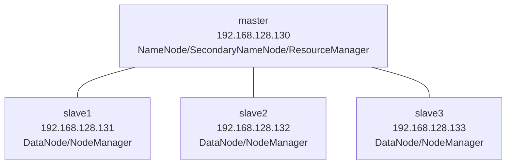
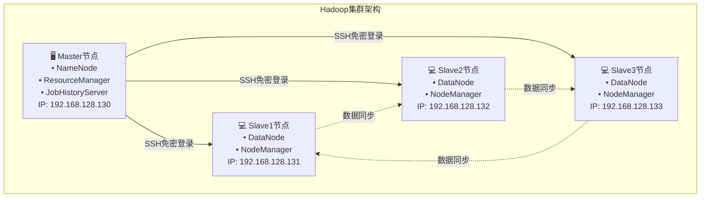
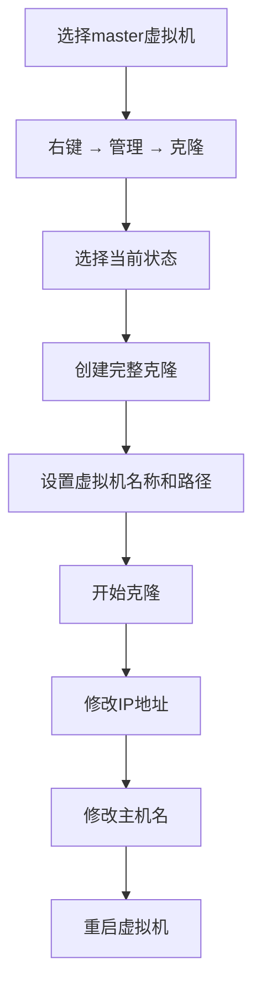

# Hadoop集群的搭建及配置2-搭建Hadoop完全分布式集群

## 📋 项目概述

为了学习 **HDFS 分布式文件系统** 和 **MapReduce 编程**，需要先搭建好 Hadoop 集群。
 Hadoop 集群常见模式：

- **单机模式**：仅在一台机器运行，不涉及分布式。
- **伪分布式模式**：单机模拟多节点集群。
- **完全分布式模式**：使用多台机器（物理机或虚拟机）搭建，贴近真实生产环境。

本文档将指导您在虚拟机环境中搭建**Hadoop完全分布式集群**，包含1个主节点（master）和3个从节点（slave1、slave2、slave3）。

### 🎯 学习目标
- 掌握Linux虚拟机的安装与配置
- 理解Hadoop集群架构
- 完成完全分布式集群的搭建和配置
- 学会集群的启动、监控和管理
- 在虚拟机环境下搭建一个 **完全分布式 Hadoop 集群**（1 个 Master + 3 个 Slave）。
- 系统环境：CentOS7.8 + JDK1.8 + Hadoop3.1.4

## 📊 集群架构图





### 节点功能说明

- **master 节点**：运行 NameNode（元数据管理）、ResourceManager（资源调度）、SecondaryNameNode（元数据备份）和 JobHistoryServer（任务历史）
- **slave 节点**：运行 DataNode（数据存储）和 NodeManager（节点资源管理）

## 🛠️ 环境准备

### 硬件要求

- 内存 ≥ 8GB
- 硬盘 ≥ 100GB
- CPU ≥ Intel i5 多核（推荐 8 核）

### 软件清单（需要可私）
| 软件 | 版本 | 安装包 | 说明 |
|------|------|--------|------|
| Linux OS | CentOS 7.8 | CentOS-7-x86_64-DVD-2003.iso | 64位操作系统 |
| JDK | 1.8+ | jdk-8u281-linux-x64.rpm | Java开发环境 |
| VMware | 15+ | VMware-workstation-full-15.5.7-17171714.exe | 虚拟机软件 |
| Hadoop | 3.1.4 | hadoop-3.1.4.tar.gz | 大数据处理框架 |
| SSH工具 | Xshell / Xftp | Xshell8.exe / Xftp8.exe | 远程连接工具 |


## 🏗️ 第一部分：Java环境安装

#### 1.1 上传JDK安装包

将JDK安装包 `jdk-8u281-linux-x64.rpm` 上传到master虚拟机的 `/opt` 目录下.

```bash
# 切换到安装包目录
cd /opt
```

按`Ctrl+Alt+F`组合键打开文件传输窗口，或者点击新建文件传输按钮，如下图


#### 1.2 安装JDK

```bash
# 安装JDK
rpm -ivh jdk-8u281-linux-x64.rpm
```


#### 1.3 验证安装

```bash
# 查看Java版本
java -version
```

出现版本信息即表示安装成功。


## ⚙️ 第二部分：Hadoop集群配置

在master虚拟机上进行Hadoop集群的相关配置，主要通过修改配置文件来完成.

### 2.1 上传并解压Hadoop

1.参考 “JDK 安装包上传” 步骤，将Hadoop安装包 `hadoop-3.1.4.tar.gz` 上传到master虚拟机的 `/opt` 目录下.

```bash
# 上传hadoop安装包到/opt
cd /opt
```


2.将 Hadoop 安装包解压至 /usr/local 目录（该目录为 Hadoop 默认推荐安装路径，便于后续配置与管理）：

```bash
# 解压到指定目录
tar -zxf hadoop-3.1.4.tar.gz -C /usr/local
```

3.解压完成后，执行以下命令查看解压结果：

```
ls /usr/local/hadoop-3.1.4
```


### 2.2 核心配置文件修改

进入 `/usr/local/hadoop-3.1.4/etc/hadoop` 目录，修改以下7个配置文件:

- **core-site.xml**: 配置Hadoop的核心属性，包括HDFS的NameNode端口和临时文件目录。例如，`fs.defaultFS` 属性值应设置为 `hdfs://master:8020`.
- **hadoop-env.sh**: 设置Hadoop运行的基本环境，需要修改 `JAVA_HOME` 的值，指向JDK在Linux系统中的安装目录.
- **yarn-env.sh**: 设置YARN框架的运行环境，同样需要修改 `JAVA_HOME` 的值.
- **mapred-site.xml**: 配置MapReduce框架。由于Hadoop 3.x使用YARN，必须将 `mapreduce.framework.name` 的值设置为 `yarn`.
- **yarn-site.xml**: 设置YARN框架的相关配置，命名一个 `yarn.resourcemanager.hostname` 变量，其值为 `master`.
- **workers**: 记录从节点（slave节点）的信息，每行一个节点名称.
- **hdfs-site.xml**: 配置HDFS相关属性，如NameNode元数据和DataNode数据存储位置。`dfs.replication` 属性默认值为3，无需修改.

```bash
cd /usr/local/hadoop-3.1.4/etc/hadoop
```


#### 🔹 core-site.xml（核心配置）

该文件用于配置 HDFS 文件系统的 NameNode 地址及 Hadoop 临时文件目录

```bash
vim core-site.xml
```

在`<configuration>`标签内添加以下内容：

```xml
<configuration>
    <property>
        <name>fs.defaultFS</name>
        <value>hdfs://master:8020</value>	<!-- NameNode地址，master为节点名，8020为默认端口 -->
        <description>HDFS文件系统的NameNode地址</description>
    </property>
    <property>
        <name>hadoop.tmp.dir</name>
        <value>/var/log/hadoop/tmp</value>	<!-- Hadoop临时文件存储目录，建议自定义路径，避免默认路径空间不足 -->
        <description>Hadoop临时文件目录</description>
    </property>
</configuration>
```


**注意**：若 NameNode 所在节点名称不是 “master”，需将 “hdfs://master:8020” 中的 “master” 替换为实际节点名。

#### 🔹 hadoop-env.sh（环境变量）

该文件用于设置 Hadoop 运行所需的环境变量，主要修改 JDK 安装目录

```bash
vim hadoop-env.sh
```

找到 “export JAVA_HOME” 相关注释行，添加或修改为以下内容（JDK 路径需与实际安装路径一致，可通过 “find /-name jdk1.8.0_281” 命令查询）：

```bash
# 添加Java环境变量
export JAVA_HOME=/usr/java/jdk1.8.0_281-amd64
```


#### 🔹 yarn-env.sh（YARN环境变量）

该文件用于设置 YARN 框架运行的环境变量，同样需指定 JDK 安装目录

```bash
vim yarn-env.sh
```

找到 “# export JAVA_HOME=/home/y/libexec/jdk1.6.0/” 注释行，添加或修改为以下内容：

```bash
# 设置YARN的Java环境
export JAVA_HOME=/usr/java/jdk1.8.0_281-amd64
```

#### 🔹 mapred-site.xml（MapReduce配置）

该文件用于配置 MapReduce 框架的运行模式（依赖 YARN）及任务历史服务端口

```bash
vim mapred-site.xml
```

在`<configuration>`标签内添加以下内容：

```xml
<configuration>
    <property>
        <name>mapreduce.framework.name</name>
        <value>yarn</value>  <!-- 指定MapReduce运行在YARN框架上 -->
    </property>
    <!-- JobHistory Server相关配置（任务历史服务） -->
    <property>
        <name>mapreduce.jobhistory.address</name>
        <value>master:10020</value>  <!-- 任务历史服务通信端口 -->
    </property>
    <property>
        <name>mapreduce.jobhistory.webapp.address</name>
        <value>master:19888</value>  <!-- 任务历史服务Web监控端口 -->
    </property>
    <property>
        <name>yarn.app.mapreduce.am.env</name>
        <value>HADOOP_MAPRED_HOME=${HADOOP_HOME}</value>  <!-- 指定MapReduce_HOME路径，引用HADOOP_HOME环境变量 -->
    </property>
    <property>
        <name>mapreduce.map.env</name>
        <value>HADOOP_MAPRED_HOME=${HADOOP_HOME}</value>
    </property>
    <property>
        <name>mapreduce.reduce.env</name>
        <value>HADOOP_MAPRED_HOME=${HADOOP_HOME}</value>
    </property>
</configuration>
```

#### 🔹 yarn-site.xml（YARN 配置）

该文件用于配置 YARN 框架的资源管理器地址、节点管理器参数等

```bash
vim yarn-site.xml
```

在`<configuration>`标签内添加以下内容：

```xml
<configuration>
    <!-- Site specific YARN configuration properties -->
    <property>
        <name>yarn.resourcemanager.hostname</name>
        <value>master</value>  <!-- YARN资源管理器（ResourceManager）所在节点名 -->
    </property>
    <property>
        <name>yarn.resourcemanager.address</name>
        <value>${yarn.resourcemanager.hostname}:8032</value>  <!-- 资源管理器通信端口 -->
    </property>
    <property>
        <name>yarn.resourcemanager.scheduler.address</name>
        <value>${yarn.resourcemanager.hostname}:8030</value>  <!-- 资源调度器端口 -->
    </property>
    <property>
        <name>yarn.resourcemanager.webapp.address</name>
        <value>${yarn.resourcemanager.hostname}:8088</value>  <!-- YARN Web监控端口 -->
    </property>
    <property>
        <name>yarn.resourcemanager.webapp.https.address</name>
        <value>${yarn.resourcemanager.hostname}:8090</value>  <!-- YARN HTTPS监控端口 -->
    </property>
    <property>
        <name>yarn.resourcemanager.resource-tracker.address</name>
        <value>${yarn.resourcemanager.hostname}:8031</value>  <!-- 资源跟踪器端口 -->
    </property>
    <property>
        <name>yarn.resourcemanager.admin.address</name>
        <value>${yarn.resourcemanager.hostname}:8033</value>  <!-- 资源管理器管理端口 -->
    </property>
    <property>
        <name>yarn.nodemanager.local-dirs</name>
        <value>/data/hadoop/yarn/local</value>  <!-- 节点管理器本地数据存储目录 -->
    </property>
    <property>
        <name>yarn.log-aggregation-enable</name>
        <value>true</value>  <!-- 启用日志聚合功能，便于查看任务日志 -->
    </property>
    <property>
        <name>yarn.nodemanager.remote-app-log-dir</name>
        <value>/data/tmp/logs</value>  <!-- 远程应用日志存储目录 -->
    </property>
    <property>
        <name>yarn.log.server.url</name>
        <value>http://master:19888/jobhistory/logs/</value>  <!-- 日志服务器URL，关联任务历史服务 -->
        <description>URL for job history server</description>
    </property>
    <property>
        <name>yarn.nodemanager.vmem-check-enabled</name>
        <value>false</value>  <!-- 关闭虚拟内存检查，避免因虚拟内存不足导致任务失败（测试环境推荐） -->
    </property>
    <property>
        <name>yarn.nodemanager.aux-services</name>
        <value>mapreduce_shuffle</value>  <!-- 启用MapReduce Shuffle服务，为MapReduce任务提供数据传输支持 -->
    </property>
    <property>
        <name>yarn.nodemanager.aux-services.mapreduce.shuffle.class</name>
        <value>org.apache.hadoop.mapred.ShuffleHandler</value>  <!-- Shuffle服务实现类 -->
    </property>
    <property>
        <name>yarn.nodemanager.resource.memory-mb</name>
        <value>2048</value>  <!-- 节点管理器可用内存，单位MB，根据虚拟机内存调整（建议不超过虚拟机内存的50%） -->
    </property>
    <property>
        <name>yarn.scheduler.minimum-allocation-mb</name>
        <value>512</value>  <!-- 任务最小申请内存 -->
    </property>
    <property>
        <name>yarn.scheduler.maximum-allocation-mb</name>
        <value>4096</value>  <!-- 任务最大申请内存 -->
    </property>
    <property>
        <name>mapreduce.map.memory.mb</name>
        <value>2048</value>  <!-- Map任务内存分配 -->
    </property>
    <property>
        <name>mapreduce.reduce.memory.mb</name>
        <value>2048</value>  <!-- Reduce任务内存分配 -->
    </property>
    <property>
        <name>yarn.nodemanager.resource.cpu-vcores</name>
        <value>1</value>  <!-- 节点管理器可用CPU核心数，根据虚拟机CPU核心数调整 -->
    </property>
</configuration>
```

#### 🔹 hdfs-site.xml（HDFS配置）

该文件用于配置 HDFS 的元数据存储目录、数据存储目录、副本数等

```bash
vim hdfs-site.xml
```

在`<configuration>`标签内添加以下内容：

```xml
<configuration>
    <property>
        <name>dfs.namenode.name.dir</name>
        <value>file:///data/hadoop/hdfs/name</value>	<!-- NameNode元数据存储目录（重要，需确保目录存在且权限充足） -->
        <description>NameNode元数据存储目录</description>
    </property>
    <property>
        <name>dfs.datanode.data.dir</name>
        <value>file:///data/hadoop/hdfs/data</value>	<!-- DataNode数据块存储目录 -->
        <description>DataNode数据存储目录</description>
    </property>
    <property>
        <name>dfs.namenode.secondary.http-address</name>
        <value>master:50090</value>	<!-- SecondaryNameNode Web监控端口（用于备份NameNode元数据） -->
    </property>
    <property>
        <name>dfs.replication</name>
        <value>3</value>	<!-- HDFS文件块副本数，默认3个，需与从节点数量一致（若从节点数少于3，需修改为对应数量） -->
        <description>数据块副本数</description>
    </property>
</configuration>
```

#### 🔹 workers（从节点列表）

该文件用于指定 Hadoop 集群的从节点（DataNode 和 NodeManager 所在节点），执行以下命令编辑文件：

```bash
 vim workers 
```

删除文件中默认的 “localhost”，添加以下内容（每个节点名占一行）：

```text
slave1
slave2
slave3
```

### 2.3 修改启动脚本

修改启动脚本Hadoop 启动 / 关闭脚本修改（避免启动失败）

需要修改以下启动脚本文件（位于`/usr/local/hadoop-3.1.4/sbin/`目录）：

- `start-dfs.sh`
- `stop-dfs.sh`  
- `start-yarn.sh`
- `stop-yarn.sh`

在每个文件开头添加：

```bash
HDFS_DATANODE_USER=root
HADOOP_SECURE_DN_USER=hdfs
HDFS_NAMENODE_USER=root
HDFS_SECONDARYNAMENODE_USER=root
YARN_RESOURCEMANAGER_USER=root
YARN_NODEMANAGER_USER=root
```


### 2.4 配置hosts文件

主机名与 IP 映射配置（/etc/hosts 文件修改）

为实现通过主机名访问各节点（无需记忆 IP 地址），需修改所有节点（master、slave1、slave2、slave3）的 /etc/hosts 文件，步骤如下：

```bash
# 编辑hosts文件
vim /etc/hosts
```

在文件末尾添加以下内容（IP 地址与节点名需与集群拓扑规划一致）：

```bash
# 添加以下映射
192.168.128.130 master
192.168.128.131 slave1
192.168.128.132 slave2
192.168.128.133 slave3
```

## 🔄 第三部分：克隆虚拟机

### 3.1 克隆步骤流程图



### （一）虚拟机克隆准备

将虚拟机master克隆，生成3个新的虚拟机slave1、slave2、slave3。

1. 在虚拟机master的安装目录“E:\Vmware”下建立3个文件slave1、slave2、slave3。
2. 关闭 master 节点虚拟机（克隆前需确保虚拟机处于关闭状态，避免文件损坏）。
3. 在 VMware 中，找到 master 虚拟机，右键点击选择 “管理”→“克隆”，进入 “克隆虚拟机向导”，点击 “下一步”。

### （二）克隆步骤（以克隆 slave1 为例）

1. **选择克隆源**：选择 “虚拟机中的当前状态”（克隆当前 master 节点的系统状态，包含已安装的 JDK 和 Hadoop 配置），点击 “下一步”。

   

2. **选择克隆类型**：选择 “创建完整克隆”（完整克隆的虚拟机完全独立，不依赖源虚拟机，适合集群节点；链接克隆依赖源虚拟机，不推荐），点击 “下一步”。


1. 设置虚拟机名称与路径：

   - 虚拟机名称：输入 “slave1”（便于区分节点）。
   - 位置：选择安装路径（建议与 master 同目录，如 “E:\VMware\slave1”），点击 “完成”。

   

2. 等待克隆完成（克隆时间根据虚拟机磁盘大小而定），点击 “关闭”，slave1 虚拟机克隆完成。


### 

### 3.2 配置各节点

从节点配置修改（slave1、slave2、slave3 均需修改）

以 slave1 为例，修改步骤如下：

1. 启动 slave1 虚拟机，使用 root 账号登录。
2. **修改 IP 地址**：
   - 执行命令编辑网卡配置文件：`vi /etc/sysconfig/network-scripts/ifcfg-ens33`。
   - 将 “IPADDR” 的值修改为 “192.168.128.131”（与集群拓扑规划的 slave1 IP 一致）。
   - 保存退出后，重启网络服务：`systemctl restart network`。
   - 执行 “ip addr” 验证 IP 是否修改成功。


3.**修改主机名**：

- 执行命令修改主机名：`hostnamectl set-hostname slave1`。
- 执行 “hostname” 验证主机名是否修改成功（若需立即生效，可重启虚拟机：`reboot`）。


4.**验证节点连通性**：

- 在 master 节点执行 “ping slave1” 命令，若能正常收到回复（出现 “64 bytes from slave1 (192.168.128.131): icmp_seq=1 ttl=64 time=0.xxx ms”），则 slave1 配置成功。


5.重复上述步骤，克隆 master 生成 slave2 和 slave3，并分别修改 IP 地址（slave2：192.168.128.132，slave3：192.168.128.133）和主机名（slave2、slave3）。

#### Slave1配置
```bash
# 修改IP地址
vim /etc/sysconfig/network-scripts/ifcfg-ens33
IPADDR=192.168.128.131

# 修改主机名
hostnamectl set-hostname slave1

# 重启网络和系统
service network restart
reboot
```

#### Slave2配置
```bash
# 修改IP地址
IPADDR=192.168.128.132
# 修改主机名
hostnamectl set-hostname slave2
```

#### Slave3配置
```bash
# 修改IP地址
IPADDR=192.168.128.133
# 修改主机名
hostnamectl set-hostname slave3
```

## 🔐 第四部分：SSH免密登录配置

（master 节点操作）

### 4.0 SSH 免密码登录原理

SSH 免密码登录通过 “公钥 - 私钥” 认证机制实现：在 master 节点生成公钥和私钥，将公钥复制到各从节点，master 节点访问从节点时，从节点使用公钥验证 master 节点的私钥，验证通过即可免密码登录，无需每次输入密码，便于集群管理与脚本执行。

### 4.1 生成SSH密钥对

- 在 master 节点执行以下命令生成 RSA 类型的密钥对（按 3 次 “Enter” 键，无需设置密码短语，测试环境推荐）：

```bash
# 在master节点执行
ssh-keygen -t rsa
# 连续按3次Enter键
```


- 执行完成后，会在 /root/.ssh 目录下生成两个文件：

​	id_rsa：私钥文件（保存在 master 节点，不可泄露）。

​	id_rsa.pub：公钥文件（需复制到各从节点）。

- 执行 `ls /root/.ssh` 命令验证密钥文件是否生成。


### 4.2 分发公钥

```bash
# 将公钥复制到各个从节点，依次输入yes, 123456(密码)
ssh-copy-id slave1
ssh-copy-id slave2
ssh-copy-id slave3
# 复制到本机（master）
ssh-copy-id master
```

或者

```bash
#显式指定使用哪个公钥文件
ssh-copy-id -i /root/.ssh/id_rsa.pub slave1
```

### 4.3 验证免密登录

```bash
# 测试连接（应该无需输入密码）
ssh slave1
ssh slave2
ssh slave3
```


## ⏰ 第五部分：时间同步配置

### 5.0 时间同步的重要性

Hadoop 集群对节点时间一致性要求极高：NameNode 与 DataNode、ResourceManager 与 NodeManager 之间通过时间戳进行通信和数据同步，若各节点时间差异较大（超过 30 秒），可能导致集群启动失败、任务执行异常等问题，因此需配置 NTP（Network Time Protocol，网络时间协议）服务实现集群时间同步。

### 5.1 安装NTP服务

1.在所有节点（master、slave1、slave2、slave3）执行以下命令安装 NTP 服务（若已配置本地 YUM 源或能联网，可直接安装）：

```bash
# 所有节点安装NTP
yum install -y ntp
```

2.若安装过程中出现 “Complete!” 信息，说明 NTP 服务安装成功；若出现 “Could not retrieve mirrorlist...” 错误，需重新挂载本地 YUM 源（执行 `mount /dev/sr0 /media`）后再次安装。


### 5.2 配置NTP服务

#### Master节点配置

（NTP 主节点，作为时间服务器）

```bash
# 编辑NTP配置
vim /etc/ntp.conf

# 注释掉默认server行，添加：
restrict 192.168.0.0 mask 255.255.255.0 nomodify notrap	# 允许内网网段同步时间但禁止修改配置
server 127.127.1.0  # 使用本地时钟作为时间源（无外网时推荐）
fudge 127.127.1.0 stratum 10  # 设置本地时钟层级（10表示本地时钟，层级越低精度越高）
```


#### Slave节点配置

（slave1、slave2、slave3，同步 master 节点时间）

1.在每个从节点执行以下命令编辑 NTP 配置文件：

```bash
vim /etc/ntp.conf
```

2.注释掉所有以 “server” 开头的默认配置，添加以下内容（指定 master 节点为时间服务器）：

```bash
# 在所有slave节点添加
# 注释掉默认server行
# 添加master作为时间服务器，同步master节点的时间
server master 
```


3.保存退出后，同样执行命令关闭防火墙并禁止开机自启：

```bash
systemctl stop firewalld
systemctl disable firewalld
```


### 5.3 启动服务

```bash
# 关闭防火墙（所有节点）
systemctl stop firewalld
systemctl disable firewalld

# 启动NTP服务
systemctl start ntpd
systemctl enable ntpd

# 从节点同步时间
ntpdate master
```

#### 1. master 节点启动 NTP 服务

1.执行以下命令启动 NTP 服务并设置开机自启：

```bash
systemctl start ntpd
systemctl enable ntpd
```

2.执行以下命令查看 NTP 服务状态：

```bash
systemctl status ntpd
```

若输出信息中包含 “active (running)”，则说明 master 节点 NTP 服务启动成功。


#### 2. 从节点同步时间并启动 NTP 服务

1.在每个从节点执行以下命令手动同步 master 节点时间（首次同步需手动触发，后续会自动同步）：

```bash
ntpdate master
```


2.执行以下命令启动 NTP 服务并设置开机自启：

```bash
systemctl start ntpd
systemctl enable ntpd
```

3.执行`systemctl status ntpd` 查看服务状态，若显示 “active (running)”，则从节点 NTP 服务启动成功。


备注：临时/一次性对时——先停掉守护进程，再执行 ntpdate

```bash
# 查看 ntpd 状态
systemctl status ntpd
# 停止 ntpd
systemctl stop ntpd        

ntpdate master
# 对完时再启动
systemctl start ntpd     
```


#### 3. 时间同步验证

在任意从节点执行 “date” 命令，查看当前时间是否与 master 节点一致（执行 “ssh master date” 查看 master 节点时间），若时间一致，则时间同步配置完成。


## 🚀 第六部分：集群启动与管理

### 6.1 环境变量配置

（所有节点操作）为便于在任意目录执行 Hadoop 命令，需在所有节点配置 Hadoop 环境变量，步骤如下：

1.执行以下命令编辑系统环境变量文件：

```bash
# 编辑profile文件（所有节点）
vim /etc/profile
```

2.在文件末尾添加以下内容（HADOOP_HOME 路径需与实际安装路径一致）：

```bash
# Hadoop环境变量
export HADOOP_HOME=/usr/local/hadoop-3.1.4
export JAVA_HOME=/usr/java/jdk1.8.0_281-amd64
# export HADOOP_CONF_DIR=$HADOOP_HOME/etc/hadoop
export PATH=$HADOOP_HOME/bin:$PATH:$JAVA_HOME/bin
```

3.保存退出后，执行以下命令使环境变量立即生效：

```bash
# 使配置生效
source /etc/profile
```

4.执行`hadoop version`命令验证环境变量是否配置成功，若输出 Hadoop 版本信息（3.1.4），则配置成功。


### 6.2 格式化NameNode

（仅 master 节点执行，且仅执行一次）

格式化 NameNode 会初始化 HDFS 文件系统的元数据存储目录，生成初始的文件系统结构，**注意：该操作仅需在集群搭建初期执行一次，后续重启集群无需再次执行，否则会导致 HDFS 数据丢失**。

1.执行以下命令格式化 NameNode：

```bash
# 在master节点执行（仅首次）
hdfs namenode -format
```

2.若执行结果中出现 “Storage directory /data/hadoop/hdfs/name has been successfully formatted” 提示，且无报错信息，则说明 NameNode 格式化成功。


### 6.3 启动集群

（master 节点执行）执行以下命令启动 Hadoop 集群（该命令会同时启动 HDFS 和 YARN 服务）：

```bash
# 在master节点执行
cd $HADOOP_HOME #进入Hadoop安装目录

sbin/start-dfs.sh  # 启动HDFS服务（NameNode、DataNode、SecondaryNameNode）
sbin/start-yarn.sh  # 启动YARN服务（ResourceManager、NodeManager）
sbin/mr-jobhistory-daemon.sh start historyserver	# 启动JobHistory服务，日志相关服务

# 或执行“start-all.sh”命令一键启动所有服务（不推荐生产环境，便于排查问题建议分开启动）
```

启动过程中，若 SSH 免密码登录配置正确，会自动登录各从节点启动对应服务，无需手动操作。

### 6.4 验证集群状态

**jps 命令**是 JDK 自带的工具，用于查看 Java 进程，可通过该命令验证各节点服务是否正常启动。

#### 1. master 节点验证

在 master 节点执行 “jps” 命令，若出现以下进程，则 HDFS 和 YARN 主服务启动成功：

```bash
12704 ResourceManager
13192 Jps
12157 NameNode
12397 SecondaryNameNode
```


#### 2. 从节点验证（以 slave1 为例）

在 slave1 节点执行 “jps” 命令，若出现以下进程，则从节点服务启动成功：

```bash
10507 Jps
10269 NodeManager
9679 DataNode
```

slave2 和 slave3 节点进程与 slave1 一致，需分别验证。

### 6.5 关闭集群

（master 节点执行）若需关闭集群，在 master 节点执行以下命令：

```bash
cd $HADOOP_HOME		 # 进入Hadoop安装目录
sbin/stop-yarn.sh	 # 先关闭YARN服务
sbin/stop-dfs.sh	 # 再关闭HDFS服务
sbin/mr-jobhistory-daemon.sh stop historyserver	# 关闭日志相关服务
# 或执行“stop-all.sh”命令一键关闭所有服务
```

关闭后，在各节点执行 “jps” 命令，若仅显示 “Jps” 进程，说明集群已成功关闭。

## 📊 第七部分：集群监控

### 7.1 Web监控界面

| 服务       | 访问地址            | 默认端口 | 功能         |
| ---------- | ------------------- | -------- | ------------ |
| HDFS       | http://master:9870  | 9870     | 文件系统监控 |
| YARN       | http://master:8088  | 8088     | 资源管理监控 |
| JobHistory | http://master:19888 | 19888    | 任务历史监控 |

### 7.2 监控界面功能说明

（本地计算机操作）Hadoop 提供 Web 界面用于监控集群状态，需先修改本地计算机的 hosts 文件（关联节点名与 IP），再通过浏览器访问。

#### 1. 修改本地 hosts 文件

1. 打开本地计算机的 “C:\Windows\System32\drivers\etc\hosts” 文件（需以管理员身份打开，否则无法编辑）。
2. 在文件末尾添加以下内容（IP 地址与集群节点 IP 一致）：

```bash
192.168.128.130 master
192.168.128.131 slave1
192.168.128.132 slave2
192.168.128.133 slave3
```

  3.保存退出（若提示 “拒绝访问”，右键点击 hosts 文件→“属性”→“安全”→给当前用户添加 “写入” 权限）。

#### 2. HDFS监控界面

1. 打开本地浏览器，在地址栏输入 “http://master:9870”（9870 为 HDFS Web 默认端口），按回车键。
2. 若能看到 HDFS 监控界面，说明 NameNode 服务正常；点击 “Utilities”→“Browse the file system”，可查看 HDFS 文件系统的目录结构（初始为空）。


- **Overview**: 显示集群基本信息和版本
- **Summary**: 显示集群状态和DataNode信息
- **Browse**: 浏览HDFS文件系统

#### 3. YARN监控界面

1. 在浏览器地址栏输入 “http://master:8088”（8088 为 YARN Web 默认端口），按回车键。
2. 若能看到 YARN 监控界面，显示集群节点数（3 个 Active Nodes）、内存总容量等信息，说明 YARN 服务正常。


- **Applications**: 查看运行中的应用
- **Nodes**: 查看集群节点状态
- **Scheduler**: 查看资源调度情况

#### 4. 访问任务历史服务 Web 界面

1. 在浏览器地址栏输入 “http://master:19888”（19888 为任务历史服务默认端口），按回车键。
2. 若能看到任务历史监控界面（初始无任务记录），说明 JobHistory Server 服务正常。


## 🔄 集群管理命令

### 启动集群
```bash
# 方式1：分别启动
start-dfs.sh
start-yarn.sh
mr-jobhistory-daemon.sh start historyserver

# 方式2：一键启动
start-all.sh
```

### 停止集群
```bash
# 分别停止
stop-yarn.sh
stop-dfs.sh
mr-jobhistory-daemon.sh stop historyserver

# 一键停止
stop-all.sh
```

### 常用管理命令
```bash
# 查看HDFS状态
hdfs dfsadmin -report

# 查看集群节点
yarn node -list

# 安全模式操作
hdfs dfsadmin -safemode leave
hdfs dfsadmin -safemode enter

# 查看HDFS使用情况
hdfs dfs -df -h
```

## 🛡️ 常见问题与解决方案

### （一）NameNode 格式化失败

1. **问题现象**：执行 “hdfs namenode -format” 时，提示 “/data/hadoop/hdfs/name does not exist”。
2. **解决方案**：手动创建元数据存储目录，执行命令：

```bash
mkdir -p /data/hadoop/hdfs/name
chown -R root:root /data/hadoop  # 确保目录权限正确（root用户可读写）
```

### （二）DataNode 启动失败

1. **问题现象**：从节点执行 “jps” 命令，无 DataNode 进程，查看日志（/usr/local/hadoop-3.1.4/logs/hadoop-root-datanode-slave1.log）提示 “Incompatible clusterIDs”。

2. **原因**：多次格式化 NameNode 导致 DataNode 的 clusterID 与 NameNode 不一致。

3. 解决方案：

   - 删除所有从节点的 DataNode 数据目录（/data/hadoop/hdfs/data）：`rm -rf /data/hadoop/hdfs/data/*`。
   - 在 master 节点重新格式化 NameNode（注意：会清除 HDFS 所有数据，谨慎操作）：`hdfs namenode -format`。
   - 重启 HDFS 服务：`stop-dfs.sh && start-dfs.sh`。
   
   ```bash
   # 清理临时文件
   rm -rf /tmp/hadoop-*
   
   # 重新格式化（谨慎操作）
   hdfs namenode -format -force
   ```

### （三）YARN Web 界面无 Active Nodes

1. **问题现象**：访问 “http://master:8088” 时，“Active Nodes” 显示为 0。

2. **原因**：NodeManager 未注册到 ResourceManager，可能是时间不同步或配置文件错误。

3. 解决方案：

   - 验证各节点时间是否同步：在从节点执行 “ntpdate master” 重新同步时间。
   - 检查 yarn-site.xml 文件中 “yarn.resourcemanager.hostname” 是否配置为 “master”。
   - 重启 YARN 服务：`stop-yarn.sh && start-yarn.sh`。

### （四）集群启动失败

```bash
# 检查日志文件
tail -f $HADOOP_HOME/logs/*.log

# 检查端口占用
netstat -tlnp | grep :8020
netstat -tlnp | grep :8088
```

## 📚 参考资源

- 实训与课程视频：[https://edu.tipdm.org](https://edu.tipdm.org/)
- 培训动态：http://www.tipdm.com/pxdt/index.jhtml
- Hadoop 官方文档：https://hadoop.apache.org/docs/r3.1.4/

## ✅ 验证清单

在完成集群搭建后，请按照以下清单验证：

- [ ] 所有虚拟机能够正常启动和连接
- [ ] 主机名解析正常（ping master、slave1等）
- [ ] SSH免密登录配置成功
- [ ] 时间同步服务正常工作
- [ ] Java环境正确安装
- [ ] Hadoop配置文件无误
- [ ] NameNode格式化成功
- [ ] 集群进程启动正常（jps检查）
- [ ] Web监控界面可正常访问
- [ ] HDFS文件操作正常

## 🎯 下一步学习建议

1. **HDFS操作实践**: 学习文件上传、下载、删除等基本操作
2. **MapReduce编程**: 编写简单的词频统计程序
3. **YARN资源调度**: 了解资源分配和任务调度机制
4. **集群调优**: 学习性能优化和故障排除
5. **生态系统**: 学习Hive、HBase、Spark等相关技术

## 📝 总结

通过本项目，您已经成功搭建了一个完整的Hadoop分布式集群环境。这个环境包含了：

- 1个Master节点（NameNode + ResourceManager）
- 3个Slave节点（DataNode + NodeManager）
- **完整的监控和管理功能**

本文档详细讲解了 **Hadoop 完全分布式集群的搭建流程**，核心步骤包括：

1. 环境准备：明确硬件要求与软件清单，规划集群拓扑结构。
2. 虚拟机搭建：完成 CentOS 系统安装、固定 IP 配置、本地 YUM 源配置。
3. 基础软件安装：安装 JDK 并验证，确保 Hadoop 运行依赖环境正常。
4. Hadoop 配置：修改 7 个核心配置文件，设置 HDFS、YARN、MapReduce 相关参数。
5. 从节点部署：通过虚拟机克隆快速创建从节点，修改 IP 与主机名。
6. 集群互通配置：实现 SSH 免密码登录与节点时间同步，保障集群通信与一致性。
7. 集群启动与验证：格式化 NameNode，启动集群服务，通过 jps 命令与 Web 界面验证集群状态。

通过本文档的学习与实践，读者可掌握 Hadoop 完全分布式集群的搭建技能，为后续 HDFS 文件操作、MapReduce 编程、Spark 等大数据框架学习奠定基础。实际操作中若遇到问题，可参考 “常见问题与解决方案” 排查，或查阅 Hadoop 官方文档（https://hadoop.apache.org/docs/r3.1.4/）获取更多帮助。记住，**实践是最好的学习方式，多动手操作，多思考问题**，您将快速掌握Hadoop技术栈。

