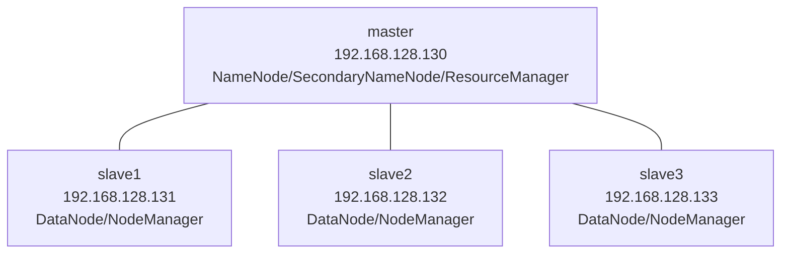
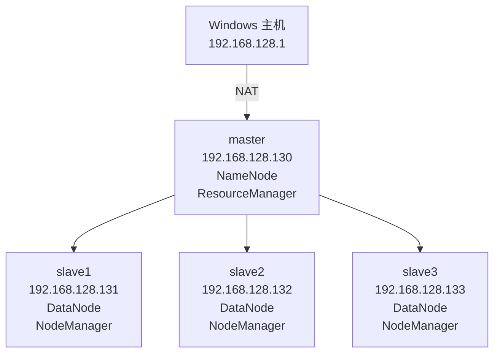
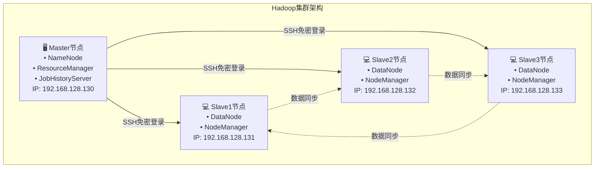
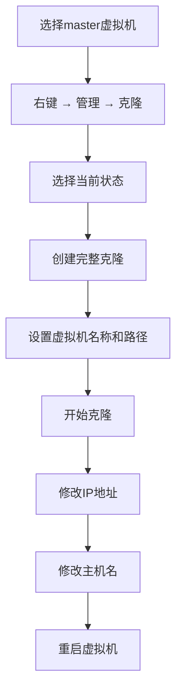

# Hadoop完全分布式集群搭建实操指南

## 📋 项目概述

本文档将指导您在虚拟机环境中搭建Hadoop完全分布式集群，包含1个主节点（master）和3个从节点（slave1、slave2、slave3）。

### 🎯 学习目标
- 掌握Linux虚拟机的安装与配置
- 理解Hadoop集群架构
- 完成完全分布式集群的搭建和配置
- 学会集群的启动、监控和管理

## 📊 集群架构图


```mermaid
graph TD
    master[master<br>192.168.128.130<br>NameNode/SecondaryNameNode/ResourceManager]
    slave1[slave1<br>192.168.128.131<br>DataNode/NodeManager]
    slave2[slave2<br>192.168.128.132<br>DataNode/NodeManager]
    slave3[slave3<br>192.168.128.133<br>DataNode/NodeManager]
    
    master --- slave1
    master --- slave2
    master --- slave3
```


```mermaid
graph TD
    PC[Windows 主机<br/>192.168.128.1] -->|NAT| Master[master<br/>192.168.128.130<br/>NameNode<br/>ResourceManager]
    Master --> Slave1[slave1<br/>192.168.128.131<br/>DataNode<br/>NodeManager]
    Master --> Slave2[slave2<br/>192.168.128.132<br/>DataNode<br/>NodeManager]
    Master --> Slave3[slave3<br/>192.168.128.133<br/>DataNode<br/>NodeManager]
```



```mermaid
graph TB
    subgraph "Hadoop集群架构"
        Master["🖥️ Master节点<br/>• NameNode<br/>• ResourceManager<br/>• JobHistoryServer<br/>IP: 192.168.128.130"]
        
        Slave1["💻 Slave1节点<br/>• DataNode<br/>• NodeManager<br/>IP: 192.168.128.131"]
        
        Slave2["💻 Slave2节点<br/>• DataNode<br/>• NodeManager<br/>IP: 192.168.128.132"]
        
        Slave3["💻 Slave3节点<br/>• DataNode<br/>• NodeManager<br/>IP: 192.168.128.133"]
        
        Master -->|SSH免密登录| Slave1
        Master -->|SSH免密登录| Slave2
        Master -->|SSH免密登录| Slave3
        
        Slave1 -.->|数据同步| Slave2
        Slave2 -.->|数据同步| Slave3
        Slave3 -.->|数据同步| Slave1
    end
```

### 节点功能说明

- **master 节点**：运行 NameNode（元数据管理）、ResourceManager（资源调度）、SecondaryNameNode（元数据备份）和 JobHistoryServer（任务历史）
- **slave 节点**：运行 DataNode（数据存储）和 NodeManager（节点资源管理）

## 🛠️ 环境准备

### 硬件要求
| 组件 | 最低配置 | 推荐配置 |
|------|----------|----------|
| 内存 | 8GB | 16GB+ |
| 硬盘 | 100GB可用空间 | 200GB+ |
| CPU | Intel i5 | Intel i7+ (8核) |

### 软件清单（需要可私）
| 软件 | 版本 | 安装包 | 说明 |
|------|------|--------|------|
| Linux OS | CentOS 7.8 | CentOS-7-x86_64-DVD-2003.iso | 64位操作系统 |
| JDK | 1.8+ | jdk-8u281-linux-x64.rpm | Java开发环境 |
| VMware | 15+ | VMware-workstation-full-15.5.7-17171714.exe | 虚拟机软件 |
| Hadoop | 3.1.4 | hadoop-3.1.4.tar.gz | 大数据处理框架 |
| SSH工具 | Xshell 5 | Xme5.exe | 远程连接工具 |


## 🔧 第一部分：虚拟机安装与配置

### 1.1 创建Master虚拟机

#### **步骤一：安装和配置 Linux 虚拟机**

1. 

   **安装 VMware Workstation**：双击下载的 `VMware-workstation-full-15.5.7-17171714.exe` 安装包，点下一步，选择安装目录，输入产品序列号即可完成安装.

   

   

2. **创建新的虚拟机**：

   - 打开 VMware 软件，选择 

     **“创建新的虚拟机”** 选项 。

     

   - 在“新建虚拟机向导”中，选择 

     **“典型(推荐)”** 模式，然后单击 **“下一步”** 。

     

   - 选择 

     **“稍后安装操作系统”**，然后单击 **“下一步”** 。

     

   - 选择客户机操作系统为 

     **“Linux”**，版本为 **“CentOS 7 64 位”**，然后单击 **“下一步”** 。

     

   - 将虚拟机命名为 

     `master`，并指定一个存放位置，例如 `E:\VMware\master` 。

     

   - 指定最大磁盘容量为 

     **20GB**，并选择 **“将虚拟磁盘拆分成多个文件”** 。

     

   - 在“准备创建虚拟机”界面，单击 

     **“自定义硬件”** 。

     

   - 在硬件设置中，选择 

     **“新CD/DVD”**，在右侧选择 **“使用 ISO 映像文件”**，然后浏览找到 `CentOS-7-x86_64-DVD-2003.iso` 镜像文件 。，然后单击 **“关闭”**  **“完成”** 。

     

   ```bash
   # 虚拟机配置参数
   名称: master
   内存: 2GB
   硬盘: 20GB (拆分存储)
   网络: NAT模式
   操作系统: CentOS 7 64位
   ```

#### 步骤2：安装CentOS系统

   1. 选择"Install CentOS 7"
   2. 语言选择：English (United States)
   3. 时区设置：Asia/Shanghai
   4. 主机名设置：master
   5. Root密码：123456

#### 步骤2：安装CentOS系统

3. **安装 CentOS 7**：

   - 在 VMware 主界面，选择新建的 

     `master` 虚拟机，单击 **“开启此虚拟机”** 。

     

   - 在安装界面中，选择 

     **“Install CentOS 7”** 。

     

   - 语言选择「English（United States）」

     

   - 进入安装页面后，进行以下配置:

     - 配置「DATE & TIME」为「Asia/Shanghai」。

       

       

     - 「INSTALLATION DESTINATION」保持默认自动分区，点击「Done」。

       

       

     - 「NETWORK & HOST NAME」设置主机名为`master`，点击 **“Begin Installation”** 开始安装。

       

     - **ROOT 密码**：设置密码（例如 `123456`），需要输入两次。

       

   - 安装完成后单击 **“Reboot”** 重启.

     


#### 步骤3：配置固定IP

1. **设置 master 节点固定 IP**：

   - 登录 master 节点（用户名`root`，密码`123456`）。

     

   - 重启网卡服务

     ```bash
     service network restart
     ```

     

   - 修改网络配置文件：

     ```bash
     vi /etc/sysconfig/network-scripts/ifcfg-ens33
     ```

   - 将 `ONBOOT` 的值改为 **`yes`**，将 `BOOTPROTO` 的值改为 **`static`**.

   - 添加 `IPADDR`（例如 192.168.128.130）、`NETMASK`、`GATEWAY` 和 `DNS1` 等配置信息.

     ```ini
     ONBOOT=yes
     BOOTPROTO=static
     #添加内容
     IPADDR=192.168.128.130
     NETMASK=255.255.255.0
     GATEWAY=192.168.128.2  # 根据VMware虚拟网络设置
     DNS1=8.8.8.8
     ```

     

   - 再次重启网络服务：

     ```bash
     service network restart
     ```

   - 验证 IP：

     ```bash
     ip addr  # 确认显示192.168.128.130
     ```

     

#### 步骤3命令汇总
```bash
# 编辑网络配置文件
vim /etc/sysconfig/network-scripts/ifcfg-ens33

# 修改配置内容
ONBOOT=yes
BOOTPROTO=static
IPADDR=192.168.128.130
NETMASK=255.255.255.0
GATEWAY=192.168.128.2
DNS1=8.8.8.8

# 重启网络服务
service network restart

# 验证IP配置
ip addr
```

### 1.2 配置远程连接

1. 安装 Xshell：双击`Xme8.exe`，按提示完成安装。

2. 配置 VMware 虚拟网络：

   - 点击「编辑」→「虚拟网络编辑器」，选择 VMnet8，子网 IP 设置为`192.168.128.0`。

   

3. Xshell 连接 master：

   - 新建会话，名称为`master`，主机填写`192.168.128.130`。
   - 「用户身份验证」输入用户名`root`和密码`123456`，点击连接并接受密钥。

   

#### 使用Xshell连接虚拟机
```bash
# 连接信息
主机: 192.168.128.130
用户名: root
密码: 123456
端口: 22
```

### 1.3 配置YUM源和软件安装

1. 进入 YUM 配置目录：

   ```bash
   cd /etc/yum.repos.d
   ```

2. 禁用默认源：

   ```bash
   mv CentOS-Base.repo CentOS-Base.repo.bak
   mv CentOS-Debuginfo.repo CentOS-Debuginfo.repo.bak
   ```

   

3. 编辑本地源配置：

   ```bash
   vi CentOS-Media.repo
   ```

   修改为：

   ```ini
   baseurl=file:///media
   gpgcheck=0
   enabled=1
   ```

   

4. 挂载 ISO 镜像：

   ```bash
   mount /dev/sr0 /media  # 若失败，检查虚拟机CD/DVD是否勾选「已连接」
   ```

   

5. 清理缓存并验证：

   ```bash
   yum clean all
   yum install -y vim zip openssh-server openssh-clients  # 安装常用工具
   ```

   

#### 配置本地YUM源-命令汇总
```bash
# 进入YUM配置目录
cd /etc/yum.repos.d

# 备份原有配置文件
mv CentOS-Base.repo CentOS-Base.repo.bak
mv CentOS-Debuginfo.repo CentOS-Debuginfo.repo.bak

# 修改Media源配置
vim CentOS-Media.repo
# 修改以下内容：
# baseurl=file:///media/
# gpgcheck=0
# enabled=1

# 挂载光盘
mount /dev/sr0 /media

# 清理缓存并测试
yum clean all
yum list
```

#### 安装必要软件
```bash
# 安装常用工具
yum install -y vim zip openssh-server openssh-clients
```

## 🏗️ 第二部分：Java环境安装

### 2.1 上传并安装JDK
```bash
# 上传JDK到/opt目录
# 使用Xshell的文件传输功能

# 安装JDK
cd /opt
rpm -ivh jdk-8u281-linux-x64.rpm

# 验证安装
java -version
```

## ⚙️ 第三部分：Hadoop集群配置

### 3.1 上传并解压Hadoop
```bash
# 上传hadoop安装包到/opt
cd /opt

# 解压到指定目录
tar -zxf hadoop-3.1.4.tar.gz -C /usr/local

# 进入配置目录
cd /usr/local/hadoop-3.1.4/etc/hadoop
```

### 3.2 核心配置文件修改

#### 🔹 core-site.xml（核心配置）
```xml
<configuration>
    <property>
        <name>fs.defaultFS</name>
        <value>hdfs://master:8020</value>
        <description>HDFS文件系统的NameNode地址</description>
    </property>
    <property>
        <name>hadoop.tmp.dir</name>
        <value>/var/log/hadoop/tmp</value>
        <description>Hadoop临时文件目录</description>
    </property>
</configuration>
```

#### 🔹 hadoop-env.sh（环境变量）
```bash
# 添加Java环境变量
export JAVA_HOME=/usr/java/jdk1.8.0_281-amd64
```

#### 🔹 yarn-env.sh（YARN环境变量）
```bash
# 设置YARN的Java环境
export JAVA_HOME=/usr/java/jdk1.8.0_281-amd64
```

#### 🔹 mapred-site.xml（MapReduce配置）
```xml
<configuration>
    <property>
        <name>mapreduce.framework.name</name>
        <value>yarn</value>
        <description>MapReduce运行在YARN上</description>
    </property>
    <property>
        <name>mapreduce.jobhistory.address</name>
        <value>master:10020</value>
    </property>
    <property>
        <name>mapreduce.jobhistory.webapp.address</name>
        <value>master:19888</value>
    </property>
    <property>
        <name>yarn.app.mapreduce.am.env</name>
        <value>HADOOP_MAPRED_HOME=${HADOOP_HOME}</value>
    </property>
    <property>
        <name>mapreduce.map.env</name>
        <value>HADOOP_MAPRED_HOME=${HADOOP_HOME}</value>
    </property>
    <property>
        <name>mapreduce.reduce.env</name>
        <value>HADOOP_MAPRED_HOME=${HADOOP_HOME}</value>
    </property>
</configuration>
```

#### 🔹 yarn-site.xml（YARN配置）
```xml
<configuration>
    <property>
        <name>yarn.resourcemanager.hostname</name>
        <value>master</value>
    </property>
    <property>
        <name>yarn.resourcemanager.address</name>
        <value>${yarn.resourcemanager.hostname}:8032</value>
    </property>
    <property>
        <name>yarn.resourcemanager.webapp.address</name>
        <value>${yarn.resourcemanager.hostname}:8088</value>
    </property>
    <property>
        <name>yarn.nodemanager.aux-services</name>
        <value>mapreduce_shuffle</value>
    </property>
    <property>
        <name>yarn.nodemanager.resource.memory-mb</name>
        <value>2048</value>
    </property>
    <property>
        <name>yarn.scheduler.minimum-allocation-mb</name>
        <value>512</value>
    </property>
    <property>
        <name>yarn.nodemanager.vmem-check-enabled</name>
        <value>false</value>
    </property>
</configuration>
```

#### 🔹 hdfs-site.xml（HDFS配置）
```xml
<configuration>
    <property>
        <name>dfs.namenode.name.dir</name>
        <value>file:///data/hadoop/hdfs/name</value>
        <description>NameNode元数据存储目录</description>
    </property>
    <property>
        <name>dfs.datanode.data.dir</name>
        <value>file:///data/hadoop/hdfs/data</value>
        <description>DataNode数据存储目录</description>
    </property>
    <property>
        <name>dfs.namenode.secondary.http-address</name>
        <value>master:50090</value>
    </property>
    <property>
        <name>dfs.replication</name>
        <value>3</value>
        <description>数据块副本数</description>
    </property>
</configuration>
```

#### 🔹 workers（从节点列表）
```text
slave1
slave2
slave3
```

### 3.3 主机名映射配置
```bash
# 编辑hosts文件
vim /etc/hosts

# 添加以下映射
192.168.128.130 master
192.168.128.131 slave1
192.168.128.132 slave2
192.168.128.133 slave3
```

## 🔄 第四部分：克隆虚拟机

### 4.1 克隆步骤流程图


```mermaid
flowchart TD
    A[选择master虚拟机] --> B[右键 → 管理 → 克隆]
    B --> C[选择当前状态]
    C --> D[创建完整克隆]
    D --> E[设置虚拟机名称和路径]
    E --> F[开始克隆]
    F --> G[修改IP地址]
    G --> H[修改主机名]
    H --> I[重启虚拟机]
```

### 4.2 配置各节点

#### Slave1配置
```bash
# 修改IP地址
vim /etc/sysconfig/network-scripts/ifcfg-ens33
IPADDR=192.168.128.131

# 修改主机名
hostnamectl set-hostname slave1

# 重启网络和系统
service network restart
reboot
```

#### Slave2配置
```bash
# 修改IP地址
IPADDR=192.168.128.132
# 修改主机名
hostnamectl set-hostname slave2
```

#### Slave3配置
```bash
# 修改IP地址
IPADDR=192.168.128.133
# 修改主机名
hostnamectl set-hostname slave3
```

## 🔐 第五部分：SSH免密登录配置

### 5.1 生成SSH密钥对
```bash
# 在master节点执行
ssh-keygen -t rsa
# 连续按3次Enter键
```

### 5.2 分发公钥
```bash
# 将公钥复制到各个从节点
ssh-copy-id root@slave1
ssh-copy-id root@slave2
ssh-copy-id root@slave3
```

### 5.3 验证免密登录
```bash
# 测试连接（应该无需输入密码）
ssh slave1
ssh slave2
ssh slave3
```

## ⏰ 第六部分：时间同步配置

### 6.1 安装NTP服务
```bash
# 所有节点安装NTP
yum install -y ntp
```

### 6.2 配置NTP服务

#### Master节点配置
```bash
# 编辑NTP配置
vim /etc/ntp.conf

# 注释掉默认server行，添加：
server 127.127.1.0
fudge 127.127.1.0 stratum 10
```

#### Slave节点配置
```bash
# 在所有slave节点添加：
server master
```

### 6.3 启动服务
```bash
# 关闭防火墙（所有节点）
systemctl stop firewalld
systemctl disable firewalld

# 启动NTP服务
systemctl start ntpd
systemctl enable ntpd

# 从节点同步时间
ntpdate master
```

## 🚀 第七部分：集群启动与管理

### 7.1 环境变量配置
```bash
# 编辑profile文件（所有节点）
vim /etc/profile

# 添加Hadoop环境变量
export HADOOP_HOME=/usr/local/hadoop-3.1.4
export PATH=$PATH:$HADOOP_HOME/bin:$HADOOP_HOME/sbin

# 使配置生效
source /etc/profile
```

### 7.2 格式化NameNode
```bash
# 在master节点执行（仅首次）
hdfs namenode -format
```

### 7.3 启动集群
```bash
# 在master节点执行
cd /usr/local/hadoop-3.1.4/sbin

# 启动HDFS
./start-dfs.sh

# 启动YARN
./start-yarn.sh

# 启动JobHistory服务
./mr-jobhistory-daemon.sh start historyserver
```

### 7.4 验证集群状态
```bash
# 在各节点检查进程
jps

# Master节点应显示：
# - NameNode
# - SecondaryNameNode
# - ResourceManager
# - JobHistoryServer

# Slave节点应显示：
# - DataNode
# - NodeManager
```

## 📊 第八部分：集群监控

### 8.1 Web监控界面

| 服务 | 访问地址 | 默认端口 | 功能 |
|------|----------|----------|------|
| HDFS | http://master:9870 | 9870 | 文件系统监控 |
| YARN | http://master:8088 | 8088 | 资源管理监控 |
| JobHistory | http://master:19888 | 19888 | 任务历史监控 |

### 8.2 监控界面功能说明

#### HDFS监控界面
- **Overview**: 显示集群基本信息和版本
- **Summary**: 显示集群状态和DataNode信息
- **Browse**: 浏览HDFS文件系统

#### YARN监控界面
- **Applications**: 查看运行中的应用
- **Nodes**: 查看集群节点状态
- **Scheduler**: 查看资源调度情况

## 🛡️ 第九部分：常见问题与解决方案

### 问题1：虚拟机无法联网
```bash
# 检查网络服务
service network status

# 重启网络服务
service network restart

# 检查IP配置
ip addr show
```

### 问题2：SSH连接失败
```bash
# 检查SSH服务状态
systemctl status sshd

# 启动SSH服务
systemctl start sshd
systemctl enable sshd
```

### 问题3：集群启动失败
```bash
# 检查日志文件
tail -f $HADOOP_HOME/logs/*.log

# 检查端口占用
netstat -tlnp | grep :8020
netstat -tlnp | grep :8088
```

### 问题4：DataNode无法启动
```bash
# 清理临时文件
rm -rf /tmp/hadoop-*

# 重新格式化（谨慎操作）
hdfs namenode -format -force
```

## 🔄 第十部分：集群管理命令

### 启动集群
```bash
# 方式1：分别启动
start-dfs.sh
start-yarn.sh
mr-jobhistory-daemon.sh start historyserver

# 方式2：一键启动
start-all.sh
```

### 停止集群
```bash
# 分别停止
stop-yarn.sh
stop-dfs.sh
mr-jobhistory-daemon.sh stop historyserver

# 一键停止
stop-all.sh
```

### 常用管理命令
```bash
# 查看HDFS状态
hdfs dfsadmin -report

# 查看集群节点
yarn node -list

# 安全模式操作
hdfs dfsadmin -safemode leave
hdfs dfsadmin -safemode enter

# 查看HDFS使用情况
hdfs dfs -df -h
```

## ✅ 验证清单

在完成集群搭建后，请按照以下清单验证：

- [ ] 所有虚拟机能够正常启动和连接
- [ ] 主机名解析正常（ping master、slave1等）
- [ ] SSH免密登录配置成功
- [ ] 时间同步服务正常工作
- [ ] Java环境正确安装
- [ ] Hadoop配置文件无误
- [ ] NameNode格式化成功
- [ ] 集群进程启动正常（jps检查）
- [ ] Web监控界面可正常访问
- [ ] HDFS文件操作正常

## 🎯 下一步学习建议

1. **HDFS操作实践**: 学习文件上传、下载、删除等基本操作
2. **MapReduce编程**: 编写简单的词频统计程序
3. **YARN资源调度**: 了解资源分配和任务调度机制
4. **集群调优**: 学习性能优化和故障排除
5. **生态系统**: 学习Hive、HBase、Spark等相关技术

## 📝 总结

通过本指南，您已经成功搭建了一个完整的Hadoop分布式集群环境。这个环境包含了：

- 1个Master节点（NameNode + ResourceManager）
- 3个Slave节点（DataNode + NodeManager）
- 完整的监控和管理功能

这个集群环境为您后续学习大数据处理、分布式计算等技术提供了坚实的基础。记住，实践是最好的学习方式，多动手操作，多思考问题，您将快速掌握Hadoop技术栈。