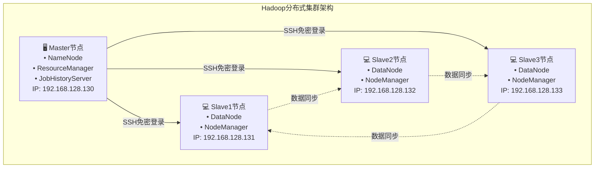

# Hadoop集群虚拟机安装配置完整指南

## 📋 文档概述

本文档详细介绍如何在VMware环境中搭建Hadoop分布式集群，包括虚拟机创建、系统安装、网络配置等完整流程。

## 🏗️ 集群架构设计

### 集群拓扑图



### 节点角色分配

| 节点 | IP地址 | 主要组件 | 功能描述 |
|------|--------|----------|----------|
| master | 192.168.128.130 | NameNode, ResourceManager | 元数据管理、资源调度 |
| slave1 | 192.168.128.131 | DataNode, NodeManager | 数据存储、任务执行 |
| slave2 | 192.168.128.132 | DataNode, NodeManager | 数据存储、任务执行 |
| slave3 | 192.168.128.133 | DataNode, NodeManager | 数据存储、任务执行 |

## 🛠️ 环境准备

### 硬件要求

为保证集群流畅运行，建议个人计算机满足以下最低硬件配置：

- **内存**：至少 8GB RAM
- **硬盘**：可用容量至少 100GB SSD/HDD
- **CPU**：Intel i5 或以上的多核处理器
- **网络**：稳定的网络连接

### 软件清单

| 软件名称 | 版本要求 | 安装包文件 | 用途说明 |
|----------|----------|------------|----------|
| VMware Workstation | 15.5+ | VMware-workstation-full-15.5.7.exe | 虚拟机平台 |
| CentOS Linux | 7.8 | CentOS-7-x86_64-DVD-2003.iso | 操作系统 |
| Java JDK | 1.8+ | jdk-8u281-linux-x64.rpm | Java运行环境 |
| Hadoop | 3.1.4 | hadoop-3.1.4.tar.gz | 大数据处理框架 |
| Xshell | 7/8 | Xshell-7.exe 或 Xme8.exe | SSH远程连接工具 |

## 🔧 第一阶段：Master节点虚拟机创建

### 步骤1：VMware安装与配置

1. **安装VMware Workstation**
   
   - 双击下载的 `VMware-workstation-full-15.5.7.exe` 安装包
   - 按照向导完成安装，选择合适的安装目录
   - 输入产品序列号激活软件
   
2. **创建新虚拟机**
   - 打开VMware，选择"创建新的虚拟机"
   - 选择"典型(推荐)"配置模式
   - 选择"稍后安装操作系统"选项
   - 客户机操作系统选择"Linux"，版本选择"CentOS 7 64位"

3. **虚拟机基础配置**
   ```
   虚拟机名称：master
   存储位置：E:\VMware\master（可自定义路径）
   磁盘容量：20GB
   磁盘类型：将虚拟磁盘拆分成多个文件
   ```

4. **硬件配置优化**
   - 内存：分配2GB RAM
   - 处理器：1个处理器，2个内核
   - 网络适配器：NAT模式
   - CD/DVD：使用ISO镜像文件，指向CentOS-7-x86_64-DVD-2003.iso

### 步骤2：CentOS 7系统安装

1. **启动安装程序**
   - 开启master虚拟机
   - 选择"Install CentOS 7"选项
   - 等待安装程序加载完成

2. **系统配置**
   - **语言设置**：English (United States)
   - **时区配置**：Asia/Shanghai
   - **安装目的地**：保持默认自动分区设置
   - **网络和主机名**：
     ```
     主机名：master
     网络：启用网络连接
     ```

3. **用户账户设置**
   - **Root密码**：123456（或设置更安全的密码）
   - 完成安装后重启系统

### 步骤3：网络配置

1. **配置静态IP地址**
   
   登录系统后，编辑网络配置文件：
   ```bash
   # 编辑网络配置文件
   vim /etc/sysconfig/network-scripts/ifcfg-ens33
   ```

2. **修改网络配置**
   ```ini
   TYPE=Ethernet
   PROXY_METHOD=none
   BROWSER_ONLY=no
   BOOTPROTO=static        # 改为静态IP
   DEFROUTE=yes
   IPV4_FAILURE_FATAL=no
   IPV6INIT=yes
   IPV6_AUTOCONF=yes
   IPV6_DEFROUTE=yes
   IPV6_FAILURE_FATAL=no
   NAME=ens33
   UUID=你的网卡UUID
   DEVICE=ens33
   ONBOOT=yes              # 开机启动网络
   
   # 新增静态IP配置
   IPADDR=192.168.128.130  # Master节点IP
   NETMASK=255.255.255.0   # 子网掩码
   GATEWAY=192.168.128.2   # 网关地址
   DNS1=8.8.8.8           # DNS服务器
   DNS2=114.114.114.114   # 备用DNS
   ```

3. **重启网络服务**
   ```bash
   # 重启网络服务
   systemctl restart network
   
   # 验证IP配置
   ip addr show ens33
   
   # 测试网络连通性
   ping -c 4 baidu.com
   ```

### 步骤4：VMware网络配置

1. **配置VMnet8虚拟网络**
   - 打开VMware，点击"编辑" → "虚拟网络编辑器"
   - 选择VMnet8 (NAT模式)
   - 子网IP设置为：192.168.128.0
   - 子网掩码：255.255.255.0
   - 应用配置

## 🔗 第二阶段：远程连接配置

### SSH连接工具安装

1. **安装Xshell**
   - 双击 `Xshell-7.exe` 或 `Xme8.exe`
   - 按照向导完成安装
   - 启动Xshell应用程序

2. **配置SSH连接**
   ```
   会话名称：master
   协议：SSH
   主机：192.168.128.130
   端口号：22
   用户名：root
   密码：123456
   ```

3. **测试连接**
   - 点击连接，接受主机密钥
   - 成功登录后可以开始远程管理

## 📦 第三阶段：系统软件配置

### YUM本地源配置

1. **进入YUM配置目录**
   ```bash
   cd /etc/yum.repos.d
   ```

2. **备份原有配置文件**
   ```bash
   # 备份网络源配置
   mv CentOS-Base.repo CentOS-Base.repo.bak
   mv CentOS-Debuginfo.repo CentOS-Debuginfo.repo.bak
   mv CentOS-Vault.repo CentOS-Vault.repo.bak
   ```

3. **配置本地ISO源**
   ```bash
   # 编辑Media源配置
   vim CentOS-Media.repo
   ```
   
   修改配置内容：
   ```ini
   [c7-media]
   name=CentOS-$releasever - Media
   baseurl=file:///media/
           file:///media/CentOS/
           file:///media/cdrom/
           file:///media/cdrecorder/
   gpgcheck=0
   enabled=1
   gpgkey=file:///etc/pki/rpm-gpg/RPM-GPG-KEY-CentOS-7
   ```

4. **挂载ISO镜像**
   ```bash
   # 创建挂载点
   mkdir -p /media
   
   # 挂载光盘
   mount /dev/sr0 /media
   
   # 验证挂载
   ls /media
   ```

5. **清理缓存并测试**
   ```bash
   # 清理YUM缓存
   yum clean all
   
   # 重建缓存
   yum makecache
   
   # 测试安装软件
   yum list | head -20
   ```

### 必要软件安装

```bash
# 安装系统工具
yum install -y vim wget curl net-tools

# 安装开发工具
yum groupinstall -y "Development Tools"

# 安装网络工具
yum install -y openssh-server openssh-clients

# 启动并启用SSH服务
systemctl start sshd
systemctl enable sshd

# 检查服务状态
systemctl status sshd
```

## 🔒 第四阶段：系统安全配置

### 防火墙配置

```bash
# 检查防火墙状态
systemctl status firewalld

# 如果需要开启特定端口（Hadoop相关）
firewall-cmd --permanent --add-port=8020/tcp  # HDFS
firewall-cmd --permanent --add-port=8030/tcp  # YARN
firewall-cmd --permanent --add-port=8040/tcp  # MapReduce
firewall-cmd --permanent --add-port=8088/tcp  # YARN Web UI
firewall-cmd --permanent --add-port=9000/tcp  # HDFS NameNode

# 重载防火墙配置
firewall-cmd --reload

# 或者在测试环境中临时关闭防火墙
systemctl stop firewalld
systemctl disable firewalld
```

### SELinux配置

```bash
# 检查SELinux状态
sestatus

# 临时禁用SELinux
setenforce 0

# 永久禁用SELinux
vim /etc/selinux/config
# 将SELINUX=enforcing改为SELINUX=disabled

# 重启生效
reboot
```

## 📋 验证检查清单

完成Master节点配置后，请按照以下清单进行验证：

### 系统基础验证
- [ ] 虚拟机能够正常启动
- [ ] 系统时间和时区配置正确
- [ ] 主机名设置为master
- [ ] Root用户可以正常登录

### 网络连通性验证
- [ ] IP地址配置为192.168.128.130
- [ ] 能够ping通网关192.168.128.2
- [ ] 能够ping通外部网站（如baidu.com）
- [ ] SSH服务正常运行在22端口

### 远程连接验证
- [ ] Xshell能够成功连接到master节点
- [ ] SSH免密登录配置正确
- [ ] 远程终端操作响应正常

### 软件环境验证
- [ ] YUM本地源配置正确
- [ ] 能够正常安装和更新软件包
- [ ] 系统必要工具安装完成
- [ ] 防火墙和SELinux配置适当

## 🚨 常见问题排查

### 问题1：虚拟机无法联网

**症状**：ping命令无法访问外部网站

**解决方案**：
```bash
# 检查网络服务状态
systemctl status network

# 重启网络服务
systemctl restart network

# 检查IP配置
ip addr show

# 检查路由表
ip route show

# 检查DNS配置
cat /etc/resolv.conf
```

### 问题2：SSH连接被拒绝

**症状**：Xshell提示"连接被拒绝"

**解决方案**：
```bash
# 检查SSH服务状态
systemctl status sshd

# 启动SSH服务
systemctl start sshd

# 检查端口监听
netstat -tlnp | grep :22

# 检查防火墙规则
firewall-cmd --list-ports
```

### 问题3：YUM安装软件失败

**症状**：yum install命令报错

**解决方案**：
```bash
# 检查挂载状态
df -h | grep media

# 重新挂载光盘
umount /media
mount /dev/sr0 /media

# 清理YUM缓存
yum clean all

# 重建缓存
yum makecache
```

### 问题4：IP地址配置不生效

**症状**：重启后IP地址丢失

**解决方案**：
```bash
# 检查网络配置文件
cat /etc/sysconfig/network-scripts/ifcfg-ens33

# 确认ONBOOT=yes
# 确认BOOTPROTO=static

# 重启网络服务
systemctl restart network

# 检查NetworkManager服务
systemctl status NetworkManager
```

## 🎯 下一步操作指南

完成Master节点配置后，建议按以下顺序继续：

1. **创建Slave节点**
   - 克隆Master虚拟机创建slave1、slave2、slave3
   - 修改各节点的IP地址和主机名
   - 配置hosts文件实现主机名解析

2. **配置SSH免密登录**
   - 在Master节点生成SSH密钥对
   - 将公钥分发到所有Slave节点
   - 测试免密登录功能

3. **安装Java环境**
   - 下载并安装JDK 1.8
   - 配置JAVA_HOME环境变量
   - 验证Java安装

4. **安装Hadoop**
   - 下载Hadoop 3.1.4
   - 配置Hadoop环境变量
   - 修改Hadoop配置文件

5. **启动集群**
   - 格式化HDFS文件系统
   - 启动Hadoop各项服务
   - 验证集群运行状态

## 📚 参考资源

- [Apache Hadoop官方文档](https://hadoop.apache.org/docs/)
- [CentOS 7网络配置指南](https://www.centos.org/docs/)
- [VMware虚拟网络配置](https://docs.vmware.com/)

## 📞 技术支持

如果在配置过程中遇到问题，建议：

1. 仔细检查每个配置步骤
2. 查看系统日志文件：`/var/log/messages`
3. 使用本文档的故障排查部分
4. 参考官方文档和社区资源

---

**注意**：本文档适用于学习和测试环境，生产环境部署请参考官方建议并加强安全配置。