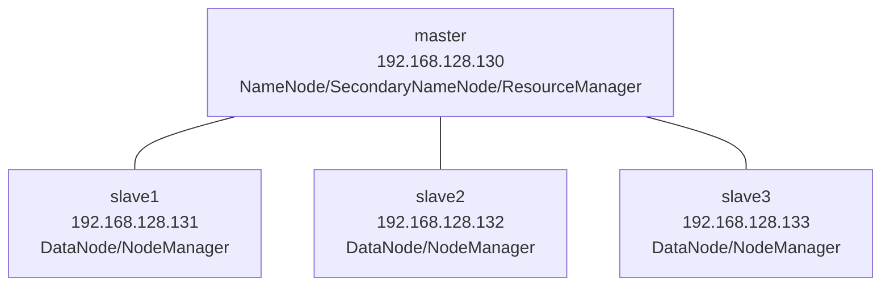

### Hadoop 完全分布式集群搭建及配置-实操文档


本文档旨在为您提供一份详尽、注重实操的 Hadoop 完全分布式集群搭建指南。您将通过以下步骤，在个人计算机上安装并配置一个包含一个主节点（master）和三个从节点（slave）的 Hadoop 集群。

------


### 📊 集群架构图


本指南将搭建一个包含 1 个主节点和 3 个从节点的完全分布式集群，其架构如下所示。

代码段



- **master 节点**：作为主节点，运行 NameNode、ResourceManager、SecondaryNameNode 和 JobHistoryServer 等核心服务。
- **slave1、slave2、slave3 节点**：作为从节点，运行 DataNode 和 NodeManager 等服务。

------

### 🛠️ 环境准备

为了确保集群的流畅运行，建议个人计算机满足以下最低硬件和软件配置：

#### 硬件要求

| 组件 | 最低配置      | 推荐配置        |
| ---- | ------------- | --------------- |
| 内存 | 8GB           | 16GB+           |
| 硬盘 | 100GB可用空间 | 200GB+          |
| CPU  | Intel i5      | Intel i7+ (8核) |

#### 软件清单

| 软件     | 版本       | 安装包                                      | 说明           |
| -------- | ---------- | ------------------------------------------- | -------------- |
| Linux OS | CentOS 7.8 | CentOS-7-x86_64-DVD-2003.iso                | 64位操作系统   |
| JDK      | 1.8+       | jdk-8u281-linux-x64.rpm                     | Java开发环境   |
| VMware   | 15+        | VMware-workstation-full-15.5.7-17171714.exe | 虚拟机软件     |
| Hadoop   | 3.1.4      | hadoop-3.1.4.tar.gz                         | 大数据处理框架 |
| SSH工具  | Xshell 8   | Xme8.exe                                    | 远程连接工具   |


### 🔧 第一部分：虚拟机安装与配置

#### 1.1 创建 Master 虚拟机

1. 安装 VMware Workstation

双击下载的 VMware-workstation-full-15.5.7-17171714.exe 安装包，按照提示完成安装，并输入产品序列号。

**2. 创建新的虚拟机**

- 打开 VMware 软件，选择 **“创建新的虚拟机”** 选项。
- 在向导中，选择 **“典型(推荐)”** 模式，点击 **“下一步”**。
- 选择 **“稍后安装操作系统”**，点击 **“下一步”**。
- 客户机操作系统选择 **“Linux”**，版本为 **“CentOS 7 64 位”**，点击 **“下一步”**。
- 将虚拟机命名为 `master`，并指定一个存放位置。
- 指定最大磁盘容量为 **20GB**，并选择 **“将虚拟磁盘拆分成多个文件”**。
- 在“准备创建虚拟机”界面，点击 **“自定义硬件”**，配置 **“新CD/DVD”** 使用 `CentOS-7-x86_64-DVD-2003.iso` 镜像文件。
- 完成创建，配置参数如下：
  - **名称**：`master`
  - **内存**：2GB
  - **硬盘**：20GB (拆分存储)
  - **网络**：NAT 模式
  - **操作系统**：CentOS 7 64位


#### 1.2 安装 CentOS 系统


1. 在 VMware 中开启 `master` 虚拟机。
2. 在安装界面中，选择 **“Install CentOS 7”**。
3. **配置安装项**：
   - **语言**：选择「English（United States）」。
   - **时区**：设置为 **Asia/Shanghai**。
   - **安装位置**：保持默认自动分区。
   - **主机名**：设置为 `master`。
   - **Root 密码**：设置密码（例如 `123456`）。
4. 点击 **“Begin Installation”** 开始安装，安装完成后点击 **“Reboot”** 重启。


#### 1.3 配置固定 IP 与远程连接


**1. 配置固定 IP**

- 登录 `master` 虚拟机（用户名 `root`，密码 `123456`）。

- 修改网络配置文件 `/etc/sysconfig/network-scripts/ifcfg-ens33`。

- 将 `ONBOOT` 值改为 `yes`，`BOOTPROTO` 值改为 `static`。

- 添加以下配置：

  Ini, TOML

  ```
  IPADDR=192.168.128.130
  NETMASK=255.255.255.0
  GATEWAY=192.168.128.2
  DNS1=8.8.8.8
  ```

- 使用 `service network restart` 命令重启网络服务。

- 使用 `ip addr` 命令验证 IP 地址是否已配置成功。

**2. 配置远程连接**

- 打开 VMware，点击 **“编辑”** -> **“虚拟网络编辑器”**，选择 **VMnet8**，将子网 IP 设置为 `192.168.128.0`。
- 打开 **Xshell**，新建会话，主机填写 `192.168.128.130`，用户名 `root`，密码 `123456`，连接成功即可。

**3. 配置本地 YUM 源**

- 进入 `/etc/yum.repos.d` 目录，备份原有配置文件。

- 编辑 `CentOS-Media.repo` 文件，修改为：

  Ini, TOML

  ```
  baseurl=file:///media
  gpgcheck=0
  enabled=1
  ```

- 使用 `mount /dev/sr0 /media` 命令挂载 ISO 镜像。

- 执行 `yum clean all` 和 `yum install -y vim zip openssh-server openssh-clients` 来安装常用工具并验证配置。

------


### 🔧 第二部分：集群配置与启动


#### 2.1 克隆 Slave 节点


- 关闭 `master` 虚拟机。
- 右键点击 `master` 虚拟机，选择 **“管理”** -> **“克隆”**。
- 选择 **“虚拟机中的当前状态”**，并选择 **“创建完整克隆”**。
- 将新虚拟机命名为 `slave1`，并指定存放位置。
- 重复此过程，分别克隆出 `slave2` 和 `slave3` 虚拟机。


#### 2.2 配置 Slave 节点


- 启动 `slave1` 虚拟机，修改其 `/etc/sysconfig/network-scripts/ifcfg-ens33` 文件中的 `IPADDR` 为 `192.168.128.131`。
- 修改其主机名为 `slave1`。
- 对 `slave2` 和 `slave3` 重复以上步骤，将 IP 分别设置为 `192.168.128.132` 和 `192.168.128.133`，主机名分别设置为 `slave2` 和 `slave3`。


#### 2.3 配置 SSH 免密登录


在 `master` 节点上，生成公钥和私钥对，并将公钥复制到所有 `slave` 节点，以实现无密码登录。

- **生成密钥**：`ssh-keygen -t rsa`
- **复制公钥**：`ssh-copy-id slave1`、`ssh-copy-id slave2`、`ssh-copy-id slave3`


#### 2.4 Hadoop 配置文件修改


进入 `/usr/local/hadoop-3.1.4/etc/hadoop` 目录，修改以下文件：

- `core-site.xml`：配置 NameNode 的端口和临时文件目录。
- `hadoop-env.sh` 和 `yarn-env.sh`：指定 JDK 的安装目录。
- `mapred-site.xml`：指定 MapReduce 框架为 YARN。
- `yarn-site.xml`：指定 ResourceManager 的主机名和相关端口。
- `workers`：添加所有从节点的主机名 (`slave1`、`slave2`、`slave3`)。
- `hdfs-site.xml`：配置 NameNode 元数据和 DataNode 数据存储位置。

同时，在所有节点上修改 `/etc/hosts` 文件，添加所有节点的主机名和 IP 地址的映射关系。


#### 2.5 启动与验证集群


1. 格式化 NameNode：

   在 master 节点上执行 hdfs namenode -format。注意：此操作在集群搭建时只需执行一次。

2. 启动集群：

   在 master 节点上，使用 start-dfs.sh 和 start-yarn.sh 命令启动集群。

3. **验证与监控**：

   - 在所有节点上执行 `jps` 命令，验证 NameNode、DataNode、ResourceManager 等进程是否正常运行。
   - 通过 Web 浏览器访问以下地址来监控集群状态：
     - **HDFS 监控界面**：`http://master:9870`
     - **YARN 监控界面**：`http://master:8088`