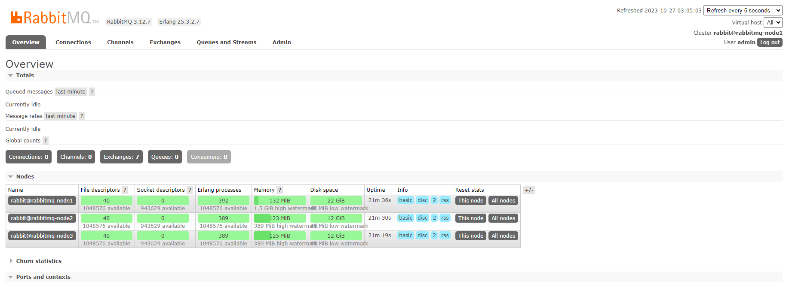
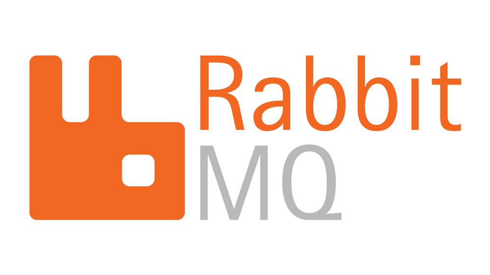

# **Rabbitmq集群部署-Docker**


RabbitMQ是一个高可用的消息中间件，不过如果说直接在本地安装，会稍显复杂，因此我们通常使用Docker容器化部署管理RabbitMQ，下面，我就来分享一下过程。

## 1，拉取镜像

在拉取镜像之前，首先要说明一下RabbitMQ的镜像版本号。在官方的Dockerhub页面，可以发现有的镜像版本号带着`management`字样：


那带这个标识与否，有什么区别呢？

在大家初次学习RabbitMQ的时候，许多教程都会说到RabbitMQ有一个**网页管理**界面，像这样的：


事实上，这个网页管理界面只是RabbitMQ的一个**插件**，也就是说，版本号带`management`的，就内部集成了这个管理插件，否则就没有。

如果你使用的是不带`management`的版本，那么部署得到的RabbitMQ就是没有这个管理页面的。

所以拉取镜像时，大家根据自己的需求拉取不同版本，当然这里还是推荐大家使用带有`manegement`版本的。

```shell
docker pull rabbitmq:management
```

## 集群信息

  node1:192.168.200.134（master）

  node2:192.168.200.135

  node3:192.168.200.136

  rabbitmq镜像版本:rabbitmq:management

  当前部署的集群适合局域网部署


## RabbitMQ集群安装


### 1、创建存储目录（所有node）

```shell
mkdir -p /data/rabbitmq/{conf,data}
```


### 2、时区（所有node）

```shell
ln -sf /usr/share/zoneinfo/Asia/Shanghai /etc/localtime
```


### 3、创建配置文件（所有node）

```shell
vim /data/rabbitmq/conf/rabbitmq.conf 

loopback_users.guest = false   # 是否只允许本机访问，配置“guest”用户能够远程连接，默认：true
listeners.tcp.default = 5672   # 监听端口
reverse_dns_lookups = false    # 设置为true,可让客户端在连接时让RabbitMQ 执行一个反向DNS查找, 然后通过 rabbitmqctl 和 管理插件来展现信息. 默认：false
```


### 4、node1部署

```shell
docker run -d \
--restart=always \
--name rabbitmq-node1 \
--hostname rabbitmq-node1 \
-e RABBITMQ_DEFAULT_USER="admin" \
-e RABBITMQ_DEFAULT_PASS="admin" \
-e RABBITMQ_ERLANG_COOKIE="1234567890qwertyuiopQWERTYUIOP" \
-p 15672:15672 -p 5672:5672 -p 4369:4369 -p 25672:25672 \
-v /etc/localtime:/etc/localtime:ro \
-v /data/rabbitmq/conf/rabbitmq.conf:/etc/rabbitmq/rabbitmq.conf \
-v /data/rabbitmq/data:/var/lib/rabbitmq \
rabbitmq:management
```

可见这里除了挂载目录之外，还暴露了两个端口，以及设定了两个环境变量：

- `15672`端口：RabbitMQ的**管理页面**端口
- `5672`端口：RabbitMQ的**消息接收**端口
- `RABBITMQ_DEFAULT_USER`环境变量：指定RabbitMQ的**用户名**，这里我指定为`swsk33`，大家部署时替换成自己定义的
- `RABBITMQ_DEFAULT_PASS`环境变量：指定RabbitMQ的**密码**，这里我指定为`123456`，大家部署时替换成自己定义的

RabbitMQ容器是通过指定环境变量的方式进行配置的，这比修改配置文件便捷得多，还有更多的配置用的环境变量，大家可以参考[官方文档](https://link.juejin.cn/?target=https%3A%2F%2Fwww.rabbitmq.com%2Fconfigure.html%23supported-environment-variables)。

### 5、node2

```shell
docker run -d \
--restart=always \
--name rabbitmq-node2 \
--hostname rabbitmq-node2 \
--add-host=rabbitmq-node1:192.168.200.134 \
--add-host=rabbitmq-node2:192.168.200.135 \
--add-host=rabbitmq-node3:192.168.200.136 \
-e RABBITMQ_DEFAULT_USER="admin" \
-e RABBITMQ_DEFAULT_PASS="admin" \
-e RABBITMQ_ERLANG_COOKIE="1234567890qwertyuiopQWERTYUIOP" \
-p 15672:15672 -p 5672:5672 -p 4369:4369 -p 25672:25672 \
-v /etc/localtime:/etc/localtime:ro \
-v /data/rabbitmq/conf/rabbitmq.conf:/etc/rabbitmq/rabbitmq.conf \
-v /data/rabbitmq/data:/var/lib/rabbitmq \
rabbitmq:management
```


### 6、node3

```shell
docker run -d \
--restart=always \
--name rabbitmq-node3 \
--hostname rabbitmq-node3 \
--add-host=rabbitmq-node1:192.168.30.131 \
--add-host=rabbitmq-node2:192.168.30.132 \
--add-host=rabbitmq-node3:192.168.30.26 \
-e RABBITMQ_DEFAULT_USER="admin" \
-e RABBITMQ_DEFAULT_PASS="admin" \
-e RABBITMQ_ERLANG_COOKIE="1234567890qwertyuiopQWERTYUIOP" \
-p 15672:15672 -p 5672:5672 -p 4369:4369 -p 25672:25672 \
-v /etc/localtime:/etc/localtime:ro \
-v /data/rabbitmq/conf/rabbitmq.conf:/etc/rabbitmq/rabbitmq.conf \
-v /data/rabbitmq/data:/var/lib/rabbitmq \
rabbitmq:3.8.9-management-alpine
```


### 7、将node2、node3加入集群

```shell
# node2加入集群
# 停止服务
docker exec rabbitmq-node2 rabbitmqctl stop_app
# 加入集群
docker exec rabbitmq-node2 rabbitmqctl join_cluster rabbit@rabbitmq-node1
# 启动服务
docker exec rabbitmq-node2 rabbitmqctl start_app


# node3加入集群
docker exec rabbitmq-node3 rabbitmqctl stop_app
docker exec rabbitmq-node3 rabbitmqctl join_cluster rabbit@rabbitmq-node1
docker exec rabbitmq-node3 rabbitmqctl start_app


# 当前加入集群都是磁盘节点，如果要加内存节点加入 --ram参数，如：
docker exec rabbitmq-node3 rabbitmqctl stop_app
docker exec rabbitmq-node3 rabbitmqctl join_cluster --ram rabbit@rabbitmq-node1
docker exec rabbitmq-node3 rabbitmqctl start_app
```

内存节点（ram）：就是将元数据都放在内存里，内存节点的话，只要服务重启，该节点的所有数据将会丢失

硬盘节点（disc）：就是将元数据都放在硬盘里，所以服务重启的话，数据也还是会存在的


### 8、查看集群状态

rabbitmq是有web控制台的，访问任意节点的15672端口，用户密码是启动docker容器是定义的




