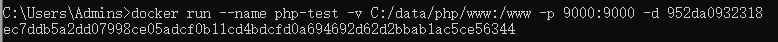

今天说一下使用Docker部署PHP环境。

# 拉取PHP镜像

首先可以通过 `docker search php` 查看PHP的镜像列表

```
docker search  docker.1ms.run/php
```


然后使用 `docker pull php:7.4-fpm` 获取PHP镜像，后面的数字可以指定PHP的版本，我安装的是PHP7.4，如果需要获取其他版本，可以通过[dockerhub](https://link.juejin.cn?target=https%3A%2F%2Fhub.docker.com%2F_%2Fphp%3Ftab%3Dtags)查询

```
docker pull docker.1ms.run/php:8.4-fpm
docker pull docker.1ms.run/php:7.4-fpm
```

可以通过 `docker images` 查看安装的镜像列表，或者通过 `docker images php` 查看php的信息。


上图中的 `IMAGE ID` 是一个重要的信息，这个是全局唯一的，由于位数太多，我们可以通过使用前几位来代表PHP这个镜像。比如 “997d”，下面我们会使用到。

# 创建容器

现在我们需要创建PHP的容器，并且启动PHP。

```dockerfile
docker run --name php-84 -v /data/php/www:/www -p 9000:9000 -d 1f8aa2d207c0
```

命令解释

- **docker run ：** 是创建一个新容器并运行一个命令
- **--name ：** 给容器起一个名字，指的是 php-test
- **-p ：** 指定宿主机与容器内部端口的映射关系，-p [宿主机端口]:[容器内部端口]，我设置的是 9000：9000
- **-d ：** 设置容器在在后台一直运行
- 最后面的 PHP 是镜像名称，也可以是镜像ID，例如上面提到的 “80bf”



启动PHP后，返回的名称为`php-test`的容器唯一ID。

可以通过 `docker ps` 查看Docker 创建的容器


> 需要注意的是，如果使用的是云服务器，需要在安全组的规则中，打开上面设置的端口号，不然是访问不了的。比如PHP使用的9000端口号。

# 通过Nginx访问PHP

### PHP配置

首先我们需要把PHP容器内的存放文件的目录挂载到宿主机中。避免重复进入PHP容器内更改。

需要先停止PHP容器，然后删除，再重新创建一个容器。

```shell
docker stop php-test
docker rm php-test
docker run --name php-84 -v /data/www:/www -p 9000:9000 -d 1f8aa2d207c0
```

- **-v:**  挂载目录, 此处 `/data/www:/www`目录为宿主机存放文件目录，`/www`为PHP容器内存放文件目录。


### Nginx配置

我们在讲解使用Docker安装Nginx时，已经把容器内的相关Nginx配置文件挂载到了宿主机内。

由于Nginx的默认配置文件 `/etc/nginx/conf.d/default.conf` 中存放默认页面的目录是 `/usr/share/nginx/html`, 由于在PHP容器内，存放文件的目录为`/www`，所以Nginx存放文件的目录也需要和PHP一致。

创建Nginx的容器命令

```shell
docker run --name nginx-test -p 80:80 \
 -v /data/nginx/nginx.conf:/etc/nginx/nginx.conf \
  -v /data/nginx/logs:/var/log/nginx \
   -v /data/www:/www \
    -v /data/nginx/conf:/etc/nginx/conf.d \
    -v /data/www:/usr/share/nginx/html \
     --privileged=true --link php-84:php -d b52e0b094bc0 
```

- **--link:**  把 **php-test** 容器的网络并入 ***nginx***，并通过修改 **nginx** 的 /etc/hosts，把域名 **php** 映射成 127.0.0.1，让 nginx 通过 php:9000 访问 php-fpm。
- 其中，php-84是我给php容器起的名字，/data/nginx/www是我在本地创建的一个文件目录，用来对应docker的www，b52e0b094bc0是php的镜像ID。

通过上面操作，PHP和Nginx容器存放文件的目录`/www`，都挂载到了宿主机`/data/www`目录下。这是为了避免相同文件修改多次。

> 注意：**PHP和Nginx容器存放文件的目录必须一致**，才能访问，不然会找不到文件。


### 配置属于PHP容器的虚拟主机

从上面创建Nginx容器的命令可以看到，我们把Nginx容器存放虚拟主机的目录`/etc/nginx/conf.d`映射到了宿主机`/data/www/nginx/conf`上，我们先把已经存在的`default.conf`文件删除或者更改名称的后缀不能为`conf`。

`mkdir php-web.conf`

```nginx
server {
    listen       80;
    server_name  localhost;
 
    location / {
        root   /www;
        index  index.html index.htm index.php;
    }
 
    error_page   500 502 503 504  /50x.html;
    location = /50x.html {
        root   /www;
    }
 
#fastcgi_pass 127.0.0.1:9000
    location ~ \.php$ {
        fastcgi_pass   php-84:9000;
        fastcgi_index  index.php;
        fastcgi_param  SCRIPT_FILENAME  /www/$fastcgi_script_name;
        include        fastcgi_params;
    }
}
```


`root   /www` 就是Nginx容器中存放文件的目录。

`fastcgi_param  SCRIPT_FILENAME  /www$fastcgi_script_name` 中 `/www`是PHP容器中存放文件的目录。

但是Nginx和PHP容器中的目录必须一致。

准备工作做好了，接下来我们新建一个访问的PHP文件。

`mkdir index.php`

```php
<?php
echo phpinfo();
```

接下来我们就可以通过 宿主机的IP访问到`index.php`文件了。


> 文中说到的存放文件的目录，可能不太准确，意思是存放代码文件。

Nginx 浏览.php文件变成下载：通常是因为nginx没有将PHP文件交给PHP解释器处理，而是直接返回了文件内容，导致浏览器将其当作下载文件。


