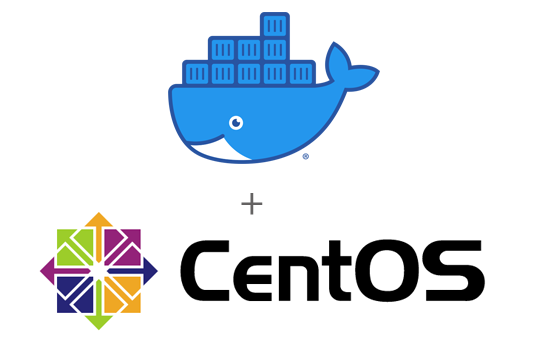
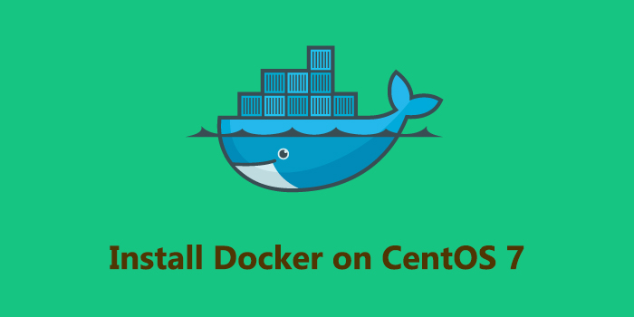

# 

## **更新 yum 包**

```shell
 yum update -y
```


## 安装 yum-utils 并添加源

为了安装 Docker，我们需要首先安装`yum-utils`，以便添加 Docker 的源。

```shell
#安装yum-utils，它属于是yum的一个扩展工具。
yum install -y yum-utils

#添加 Docker 的资源库。
yum-config-manager --add-repo https://download.docker.com/linux/centos/docker-ce.repo
```


官网的速度可能较慢，这里也可以添加阿里云的资源库。

```shell
#可选
yum-config-manager --add-repo http://mirrors.aliyun.com/docker-ce/linux/centos/docker-ce.repo
```

## 安装 Docker

直接使用`yum`命令即可安装 Docker。

```shell
yum install docker-ce docker-ce-cli containerd.io
```

其中 docker-ce 是 Docker 的社区版，专门用于开发人员和小团队创建基于容器的应用。比如，我们现在就是在搭建开发环境。docker-ce-cli 相当于是个命令行工具。containerd.io 是 一个守护进程。

## 运行并设置自启动

Docker 安装完之后不会自动运行，需要手动运行：

```shell
systemctl start docker
```

可使用`docker ps`命令查看 Docker 运行状态，如看到输出正在运行的窗口列表，则启动成功：

```shell
CONTAINER ID IMAGE COMMAND CREATED STATUS PORTS NAMES
```


为了让 Docker 在每次重启系统的时候能自动运行，还需要设置自启动：

```shell
systemctl enable docker
```

至此就大功告成了。可以使用`hello-world`镜像验证一下：

```dockerfile
docker run hello-world
```

看到以下输出即为成功：

```sh
Unable to find image 'hello-world:latest' locally
latest: Pulling from library/hello-world
93288797bd35: Pull complete
Digest: sha256:37a0b92b08d4919615c3ee023f7ddb068d12b8387475d64c622ac30f45c29c51
Status: Downloaded newer image for hello-world:latest

Hello from Docker!
This message shows that your installation appears to be working correctly.

To generate this message, Docker took the following steps:
 1. The Docker client contacted the Docker daemon.
 2. The Docker daemon pulled the "hello-world" image from the Docker Hub.
 3. The Docker daemon created a new container from that image which runs the
    executable that produces the output you are currently reading.
 4. The Docker daemon streamed that output to the Docker client, which sent it
    to your terminal.

To try something more ambitious, you can run an Ubuntu container with:
 $ docker run -it ubuntu bash

Share images, automate workflows, and more with a free Docker ID:
 https://hub.docker.com/

For more examples and ideas, visit:
 https://docs.docker.com/get-started/
```


## 5、查看 Docker 版本

查看 Docker 的版本，其实就类似于我们安装完 JDK 并配置完 JDK 的环境变量以后，通过 java -version 来验证一下安装和配置是否正确。我们通过 docker version 来查看 Docker 是否安装成功。

```dockerfile
docker version
```





