## Docker 将容器制作成镜像并上传docker hub仓库

### 前言

#### 之前通过docker搭建过各种环境，如果想要在不同的机器上搭建一样的环境，就可以将之前搭建的镜像上传到镜像仓库，这样方便在不同的机器上快速搭建同一套环境。 如果公开的话，别人也可以用你的镜像快速搭建环境，类似于 GitHub 本地代码上传到代码仓库，再从仓库拉取代码到本地。

在使用docker时候常常需要把自己配置好环境的容器制作成镜像并上传到dockerhub以便之后拉取。本篇文章就是介绍如何将docker容器制作成镜像并上传到dockerhub。

## 背景

很多docker hub上拉下来的镜像，通过修改配置文件等操作，定制成了适合自己的镜像，以后用自己的镜像就可以，因此需要上传到docker hub，以后可以像代码一样管理维护自己的docker镜像。

## 1.注册docker hub账号

访问Docker Hub官网：https://hub.docker.com/

## 2.docker hub上创建仓库

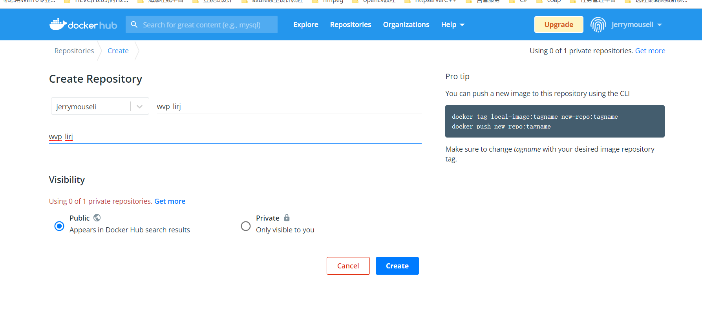
创建成功如下图：
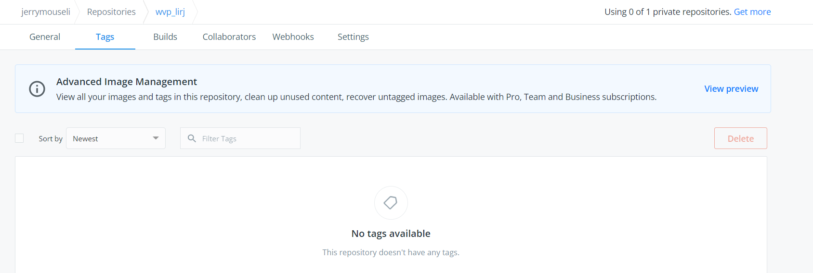

## 3.打包容器

### 3-1 查看容器列表

首先是查看容器：在**命令台**中键入 `docker ps -a` 命令，得到如下界面。

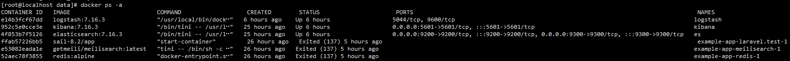

### 3-2 从容器创建一个新镜像

`docker commit` 命令主要是实现从容器创建一个新镜像。

```shell
# docker commit 容器名 镜像名：版本名（若没有"：版本名" 则直接默认为latest）
docker commit CONTAINER <hub-user>/<repo-name>:<tag>
```

这里的tag不指定就是latest。

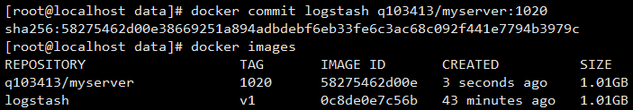

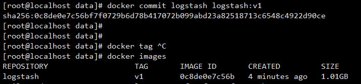

sha256是镜像文件的校验码。

### 3-3 打本地标签tag

在上传之前，先给本地镜像打个tag标签，相当于重新复制镜像并重命名为docker账户名/仓库名称

```shell
# docker tag 本地镜像:tag docker账号/docker仓库:tag
docker tag <existing-image> <hub-user>/<repo-name>[:<tag>]
docker images
```

## 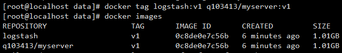

## 4. 本地登录

docker hub 帐号在本地验证登陆

```shell
docker login
```

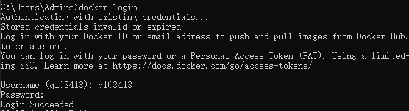

## 5.push 镜像到docker hub 的仓库

```shell
# docker push docker账号/仓库名称:tagname
docker push <hub-user>/<repo-name>:<tag>
```

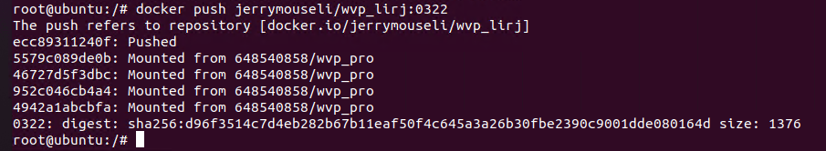

## 6.验证

### 6.1 命令验证

**docker inspect :** 获取容器/镜像的元数据。

```shell
# docker inspect [OPTIONS] NAME|ID [NAME|ID...]
docker inspect image
```

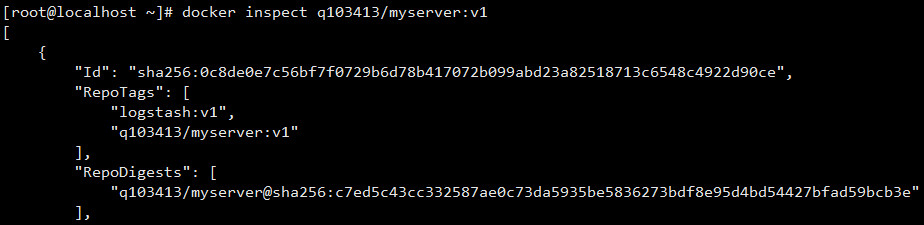

### 6.2 线上仓库验证

 上传完成后打开自己的docker hub账号，查看镜像仓库 

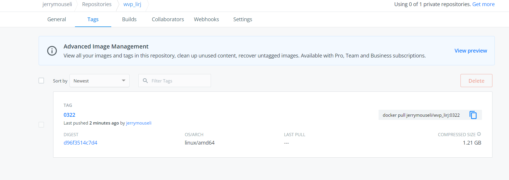

## 7.pull 拉取镜像

```shell
docker login

# docker rmi <hub-user>/<repo-name>:<tag>
# docker pull 你自己的镜像名称
docker pull <hub-user>/<repo-name>:<tag>
```

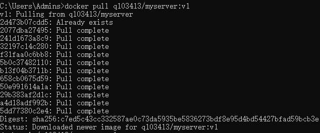

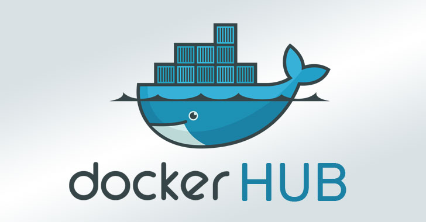

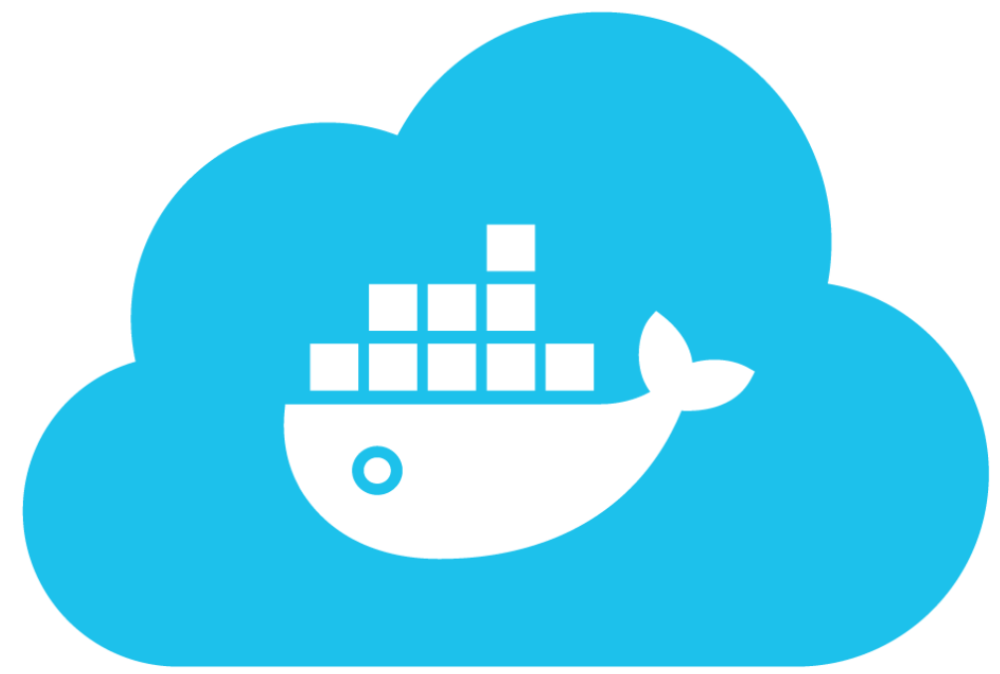

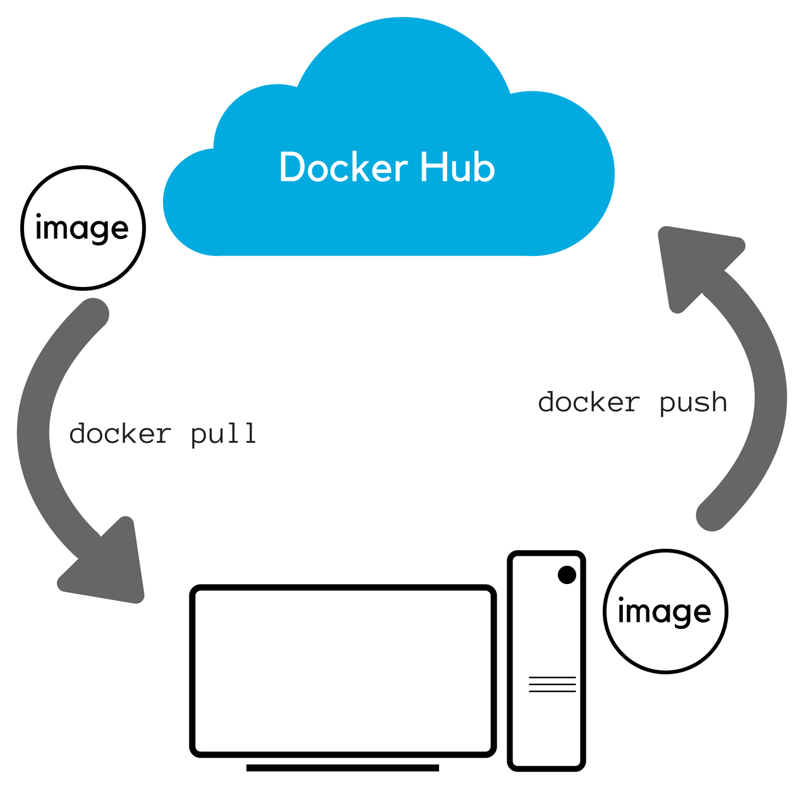
