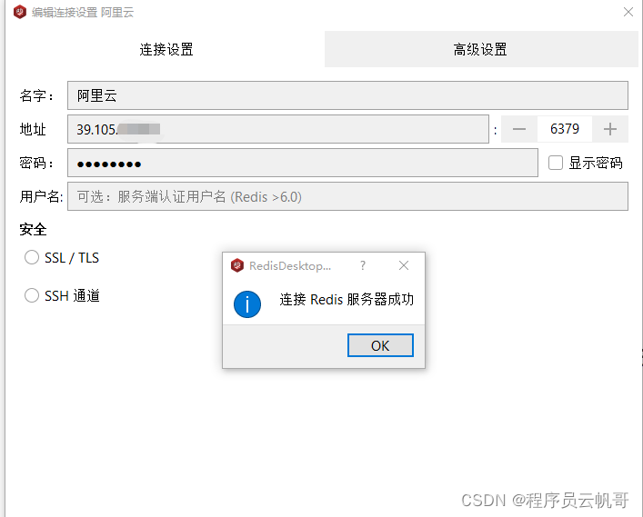

maple639555@gmail.com

docker安装redis

### 1、查看可用的 Redis 版本

```shell
docker search redis
```

### 2、取最新版的 Redis 镜像

这里我们拉取官方的最新版本的镜像：

```shell
docker pull redis:latest
```

### 3、查看本地镜像

使用以下命令来查看是否已安装了 redis：

```shell
docker images | grep redis
```

### 2、创建挂载目录

```
mkdir /usr/local/docker/redis
```

#### 三、修改配置文件

1. 创建配置文件目录存放redis.conf，文件从[官网下载](http://download.redis.io/redis-stable/redis.conf)

   ```
   wget http://download.redis.io/redis-stable/redis.conf
   ```

2. ### 权限

   ```
   chmod 777 redis.conf
   ```

   

3. 新建配置文件贴入从官网下载的配置文件并修改

```bash
vi /usr/local/docker/redis/redis.conf
```

1. 修改启动默认配置(从上至下依次)

```bash
bind 127.0.0.1 #注释掉这部分，这是限制redis只能本地访问

protected-mode no #默认yes，开启保护模式，限制为本地访问

daemonize no#默认no，改为yes意为以守护进程方式启动，可后台运行，除非kill进程，改为yes会使配置文件方式启动redis失败

databases 16 #数据库个数（可选），我修改了这个只是查看是否生效。。

dir  ./ #输入本地redis数据库存放文件夹（可选）

appendonly yes #redis持久化（可选）
```

# 四、docker启动redis

### 1、快速启动

```css
docker run -itd --name redis-test -p 6379:6379 redis
```

参数说明：
 -p 6379:6379：映射容器服务的 6379 端口到宿主机的 6379 端口。外部可以直接通过宿主机ip:6379 访问到 Redis 的服务。

### 2、配置文件启动

```shell
docker run -p 6379:6379 --name myredis -v /usr/local/docker/redis/redis.conf:/etc/redis/redis.conf -v /usr/local/docker/redis/data:/data -d redis redis-server /etc/redis/redis.conf --appendonly yes
```

参数解释说明：

- -p 6379:6379 端口映射：前面是宿主机：后表示容器部分。
- --name myredis  指定该容器名称，查看和进行操作都比较方便。
- -v 挂载文件或目录：前面是宿主机，后面是容器。
- -v 挂载目录，规则与端口映射相同。
   为什么需要挂载目录：个人认为docker是个沙箱隔离级别的容器，这个是它的特点及安全机制，不能随便访问外部（主机）资源目录，所以需要这个挂载目录机制。
   例： -v /usr/local/docker/redis/redis.conf:/etc/redis/redis.conf  容器 /etc/redis/redis.conf 配置文件 映射宿主机 /usr/local/docker/redis/redis.conf。  会将宿主机的配置文件复制到docker中
   **重要： 配置文件映射，docker镜像redis 默认无配置文件。**
- -d redis 表示后台启动redis
- redis-server /etc/redis/redis.conf  以配置文件启动redis，加载容器内的conf文件，最终找到的是挂载的目录/usr/local/docker/redis/redis.conf
   **重要:  docker 镜像reids 默认 无配置文件启动**
- -d redis redis-server /etc/redis/redis.conf：表示后台启动redis，以配置文件启动redis，加载容器内的conf文件。
- --appendonly yes  开启redis 持久化


### 7、检查redis运行状态

```bash
docker ps
```

# 五、查看是否运行成功


```ruby
[root@localhost docker]# docker ps -a | grep redis
602659d1b445        redis                              "docker-entrypoint.s…"   54 minutes ago      Up 54 minutes                  0.0.0.0:6379->6379/tcp   modest_ramanujan
65bb6e6cab9f        redis                              "docker-entrypoint.s…"   About an hour ago   Exited (0) About an hour ago                            myredis
```

# 六、docker基本命令

查看所有镜像 docker images

删除镜像(会提示先停止使用中的容器) docker rmi  镜像name/镜像id

查看所有容器 docker ps -a

查看容器运行日志 docker logs 容器名称/容器id

停止容器运行 docker stop 容器name/容器id

终止容器后运行 docker start 容器name/容器id

容器重启 docker restart 容器name/容器id

删除容器 docker rm 容器name/容器id

### 4、运行容器

安装完成后，我们可以使用以下命令来运行 redis 容器：

1. 创建容器

```shell
$ docker run -itd --name redis-test -p 26379:6379 redis
```

参数说明：

- **-p 6379:6379**：映射容器服务的 6379 端口到宿主机的 6379 端口。外部可以直接通过宿主机ip:6379 访问到 Redis 的服务。

冒号前是外部访问端口，冒号后面是内部服务端口

2. 解读参数

-d: 后台运行容器，并返回容器ID；

-i: 以交互模式运行容器，通常与 -t 同时使用；

-p: 端口映射，格式为：主机(宿主)端口:容器端口

-t: 为容器重新分配一个伪输入终端，通常与 -i 同时使用；

--ip: 为容器制定一个固定的ip

--net: 指定网络模式

测试

```
$ docker cp redis.crt redis:/usr/local/etc/redis/
$ docker cp redis.key redis:/usr/local/etc/redis/
```

### 8、检查连接状况


