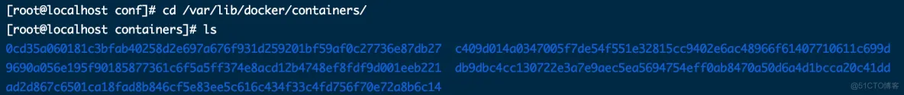
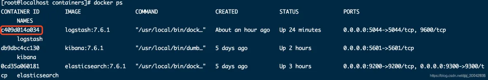
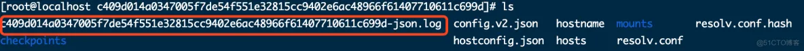

# Docker删除容器日志

平时我们经常查看容器的日志，命令如下：

```
docker logs -f 容器名或者容器id
```

随着时间的推移，日志文件越来越大，那么我们该如何清理日志文件呢？下面来讲解清理的步骤：

1.进入docker容器目录：

```
cd /var/lib/docker/containers/
```



2.查看容器的id，获取容器id，容器id就是容器目录名字

```
docker ps -a
```



3.进入容器，删除以`log`结尾的文件就是日志文件了，删除即可：

```
rm -rf 容器id.log
```



4.重启容器

```
docker restart 容器名或者容器id
```

完成！！！

