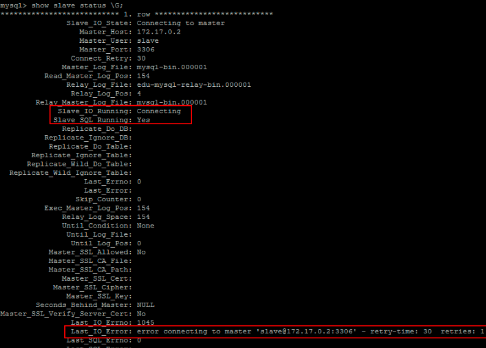

docker部署MySQL5.7主从

# 基于 Docker 的 MySQL 主从复制搭建及原理（真正弄懂）

### 为什么基于 Docker 搭建？

- 资源有限
- 虚拟机搭建对机器配置有要求，并且安装 mysql 步骤繁琐
- 一台机器上可以运行多个 Docker 容器
- Docker 容器之间相互独立，有独立 ip，互不冲突
- Docker 使用步骤简便，启动容器在秒级别

### 利用 Docker 搭建主从服务器

首先拉取 docker 镜像，我们这里使用 5.7 版本的 mysql：
`docker pull mysql:5.7`
然后使用此镜像启动容器，这里需要分别启动主从两个容器

### Master (主)：

```shell
docker run -p 3339:3306 --name mysql-master -e MYSQL_ROOT_PASSWORD=123456 -d mysql:5.7
```

### Slave (从)

`docker run -p 3340:3306 --name mysql-slave -e MYSQL_ROOT_PASSWORD=123456 -d mysql:5.7`
Master 对外映射的端口是 3339，Slave 对外映射的端口是 3340。因为 docker 容器是相互独立的，每个容器有其独立的 ip，所以不同容器使用相同的端口并不会冲突。这里我们应该尽量使用 mysql 默认的 3306 端口，否则可能会出现无法通过 ip 连接 docker 容器内 mysql 的问题。
使用 `docker ps` 命令查看正在运行的容器：


此时可以使用 Navicat 等工具测试连接 mysql


### 配置 Master（主）

通过 `docker exec -it 5ddad8c2f368 /bin/bash` 命令进入到 Master 容器内部，也可以通过 `docker exec -it mysql-master /bin/bash` 命令进入。5ddad8c2f368 是容器的 id, 而 mysql-master 是容器的名称。
`cd /etc/mysql/mysql.conf.d` 切换到 /etc/mysql/mysql.conf.d 目录下，然后 `vim mysqld.cnf` 对 my.cnf 进行编辑。此时会报出 `bash: vim: command not found`，需要我们在 docker 容器内部自行安装 vim。使用 `apt-get install vim` 命令安装 vim
会出现如下问题：


执行 `apt-get update`，然后再次执行 `apt-get install vim` 即可成功安装 vim。然后我们就可以使用 vim 编辑 my.cnf，在 my.cnf 中添加如下配置：

```php
[mysqld]
## 同一局域网内注意要唯一
server-id=100  
## 开启二进制日志功能，可以随便取（关键）
log-bin=mysql-bin
```

配置完成之后，需要重启 mysql 服务使配置生效。使用 `service mysql restart` 完成重启。重启 mysql 服务时会使得 docker 容器停止，我们还需要 `docker start mysql-master` 启动容器。
下一步在 Master 数据库创建数据同步用户，授予用户 `slave REPLICATION SLAVE` 权限和 `REPLICATION CLIENT` 权限，用于在主从库之间同步数据。
首先连接 mysql 数据库
`root@5ddad8c2f368:/# mysql -uroot -p123456`
`CREATE USER 'slave'@'%' IDENTIFIED BY '123456';`
`GRANT REPLICATION SLAVE, REPLICATION CLIENT ON *.* TO 'slave'@'%';`

> > 授予复制账号 `REPLICATION CLIENT` 权限，复制用户可以使用 `SHOW MASTER STATUS, SHOW SLAVE STATUS` 和 `SHOW BINARY LOGS` 来确定复制状态。
> > 授予复制账号 `REPLICATION SLAVE` 权限，复制才能真正地工作。


### 配置 Slave (从)

和配置 Master (主) 一样，在 Slave 配置文件 my.cnf 中添加如下配置：

```php
[mysqld]  
## 设置server_id,注意要唯一  server-id=101 
## 开启二进制日志功能，以备Slave作为其它Slave的Master时使用  
log-bin=mysql-slave-bin 
## relay_log配置中继日志  
relay_log=edu-mysql-relay-bin
```

配置完成后也需要重启 mysql 服务和 docker 容器，操作和配置 Master (主) 一致。

> > relay log 很多方面都跟 binary log 差不多。区别是：从服务器 I/O 线程将主服务器的二进制日志读取过来记录到从服务器本地文件，然后 SQL 线程会读取 relay-log 日志的内容并应用到从服务器，从而使从服务器和主服务器的数据保持一致。


### 链接 Master (主) 和 Slave (从)

在 Master 进入 mysql，执行 `show master status;`

File 和 Position 字段的值后面将会用到，在后面的操作完成之前，需要保证 Master 库不能做任何操作，否则将会引起状态变化，File 和 Position 字段的值变化。
在 Slave 中进入 mysql，执行

```php
CHANGE MASTER TO master_host = '172.17.0.2',
master_user = 'slave',
master_password = '123456',
master_port = 3306,
master_log_file = 'mysql-bin.000001',
master_log_pos = 617,
master_connect_retry = 30;
```

**命令说明：**
**master_host** ：Master 的地址，指的是容器的独立 ip, 可以通过 docker inspect --format='{{.NetworkSettings.IPAddress}}' 容器名称 | 容器 id 查询容器的 ip


**master_port**：Master 的端口号，指的是容器的端口号
**master_user**：用于数据同步的用户
**master_password**：用于同步的用户的密码
**master_log_file**：指定 Slave 从哪个日志文件开始复制数据，即上文中提到的 File 字段的值
**master_log_pos**：从哪个 Position 开始读，即上文中提到的 Position 字段的值
**master_connect_retry**：如果连接失败，重试的时间间隔，单位是秒，默认是 60 秒
在 Slave 中的 mysql 终端执行 `show slave status \G;` 用于查看主从同步状态。

正常情况下，SlaveIORunning 和 SlaveSQLRunning 都是 No，因为我们还没有开启主从复制过程。使用 `start slave` 开启主从复制过程，然后再次查询主从同步状态 `show slave status \G;`。

SlaveIORunning 和 SlaveSQLRunning 都是 Yes，说明主从复制已经开启。此时可以测试数据同步是否成功。
**主从复制排错：**

使用 `start slave` 开启主从复制过程后，如果 SlaveIORunning 一直是 Connecting，则说明主从复制一直处于连接状态，这种情况一般是下面几种原因造成的，我们可以根据 Last_IO_Error 提示予以排除。

- 网络不通
  检查 ip, 端口
- 密码不对
  检查是否创建用于同步的用户和用户密码是否正确
- pos 不对
  检查 Master 的 Position

## 测试主从复制

测试主从复制方式就十分多了，最简单的是在 Master 创建一个数据库，然后检查 Slave 是否存在此数据库。
**Master:**

**Slave:**


### 完整的主备流程图

最后让我们来看一下，一个 update 语句在节点 A 执行，然后同步到节点 B 的完整流程图。

可以看到：主库接收到客户端的更新请求后，执行内部事务的更新逻辑，同时写入 binlog。
备库 B 跟主库 A 之间维持了一个长连接。主库 A 内部有一个线程，专门用于服务备库 B 的这个长连接。
一个事务日志同步的完整过程是这样的：

- 1、在备库 B 上通过 `change master` 命令，设置主库 A 的 IP、端口、用户名、密码、以及要从哪个位置开始请求 binlog，这个位置包含文件名和日志偏移量。
- 2、在备库 B 上执行 `start slave` 命令，这时侯备库会启动两个线程，io_thread 和 sql_thread。其中， io_thread 负责与主库建立连接。
- 3、主库 A 校验完用户名、密码后，开始按照备库 B 传过来的位置，从本地读取 binlog，发给 B。
- 4、备库 B 拿到 binlog 后，写到本地文件，称为中转日志（relay log）。
- 5、sql_thread 读取中转日志，解析日志里的命令，并执行。

