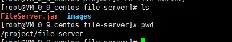
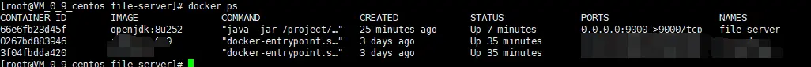
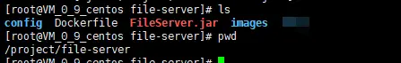
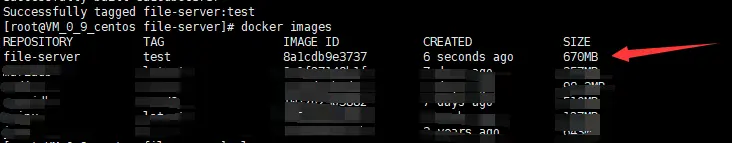
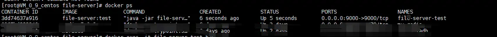
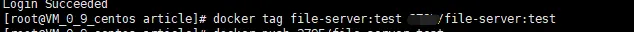
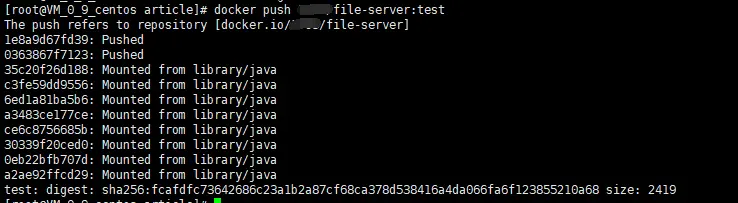
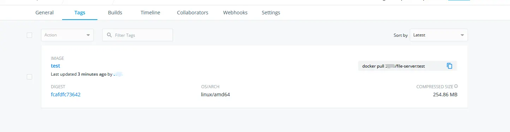

# 使用Docker运行jar文件

### 前言

使用Java运行Jar文件，这里的Jar文件以SpringBoot打包成的Jar为例。

这个Jar应用为一个图片服务器，我将上传的图片放在了`/project/file-server/images`这个路径下面，所以我需要将这个容器中的这个路径映射到宿主机中(`-v /project/file-server:/project/file-server`)，不然容器删除后图片就没了。

### 方法一：使用Java镜像直接运行

#### 1. 拉取Java镜像

##### 1.1 开启阿里云加速

docker的默认镜像仓库在国外，直接下载会很慢，这里启动阿里云加速。

在`/etc/docker`目录下创建`daemon.json`文件，添加如下内容：

```
复制代码# 该地址为阿里云的加速地址
{
  "registry-mirrors": ["https://almtd3fa.mirror.aliyuncs.com"]
}
```

之后重启docker

```
systemctl daemon-reload

service docker restart
```

##### 1.2 拉取Java镜像

镜像查询地址如下：

```
https://hub.docker.com/_/openjdk?tab=tags
```

拉取Java镜像：

```
docker pull openjdk:latest
```

#### 2. 运行Jar文件

Jar文件的存放路径为`/project/file-server`





执行命令生成容器启动Jar

```
docker run -d -p 9000:9000 -v /project/file-server:/project/file-server --name file-server openjdk:latest java -jar /project/file-server/FileServer.jar
```

- `-d`：后台运行
- `-p`：端口映射
- `-v /project/file-server:/project/file-server`: 将宿主机的路径映射到容器中
- `--name`： 定义生成容器的名称

查看容器是否启动成功：





可以看到`name`为`file-server`的容器生成并运行成功了。

#### 3. 与传统的运行方式对比

使用传统的方式运行Jar文件，那么你需要在服务器上安装Java环境，再配置环境变量，最后再使用`java -jar`命令运行Jar包。

而使用Java镜像这种方式运行Jar文件，相当于把安装Java环境和配置环境变量这个工作交给了Java镜像，其他的并没有什么区别。

### 方法二：利用Docker创建镜像运行Jar文件

#### 1. 创建Dockerfile文件

```
复制代码FROM java:8
MAINTAINER 3795
ADD FileServer.jar file-server.jar
COPY config config
EXPOSE 9000
ENTRYPOINT ["java", "-jar", "file-server.jar"]
```

- FROM: 基础镜像，基于jdk8镜像开始
- MAINTAINER：作者
- ADD：将jar文件添加（复制）到镜像内，`FileServer.jar`源jar文件，`file-server.jar`复制得到的jar文件。
- COPY: 将应用的配置文件也拷贝到镜像中。
- EXPOSE：声明端口
- ENTRYPOINT：docker启动时，运行的命令，这里容器启动时直接运行jar服务。

> 在添加或复制文件到镜像中时，如果不指定目标路径，则默认将文件添加到容器的`/`路径下。

#### 2. 构建镜像

先看Dockerfile所在的目录





在当前目录下执行命令：

```
docker build -t file-server:test .
```

- file-server: 镜像的名称
- test: 镜像的`tag`，如果不写，则默认为`latest`
- `.`: 这个`.`一定不能忘记，最后的`.`代表本次执行的上下文路径，`ADD FileServer.jar file-server.jar`，中间的`FileServer.jar`在哪里，就是根据这个`.`确定的，在上述Dockerfile，表示将当前文件夹下的`FileServer.jar`和`config`文件夹添加到容器中。

查看镜像：





构建成功！

#### 3. 运行镜像

```
复制代码docker run -d --name file-server-test -p 9000:9000 -v /project/file-server:/project/file-server file-server:test
```

容器运行情况





可以看到容器成功运行了。

#### 4. 将镜像提交到DockerHub中

##### 4.1 注册DockerHub账号并创建仓库

略，我创建了一个名为`file-server`的仓库

参考: [Docker 仓库管理](https://link.juejin.cn/?target=https%3A%2F%2Fwww.runoob.com%2Fdocker%2Fdocker-repository.html)

##### 4.2 使用docker login

略

##### 4.3 提交镜像

```
docker tag <existing-image> <hub-user>/<repo-name>[:<tag>]
```





如果我们只要容器，怎么把容器提交到仓库呢？

将容器先制作为镜像，再上传。

```
docker commit <exiting-Container> <hub-user>/<repo-name>[:<tag>]
```

这里的tag不指定就是latest。

##### 4.5 push镜像到远程仓库

```
docker push <hub-user>/<repo-name>:<tag>
```





耗时可能会稍长一些。

到仓库中查看镜像：





这样推送到仓库就成功了，后面可以直接`docker pull`再`docker run`就可以运行了。

标签：

[Docker](https://juejin.cn/tag/Docker)