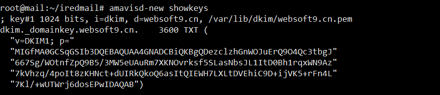
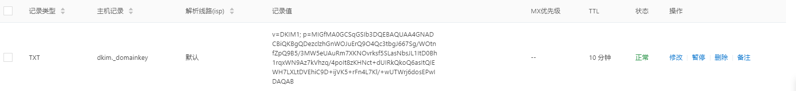
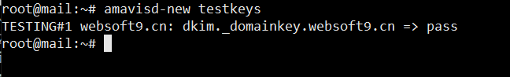

# [iRedMail](https://www.iredmail.org/)域名证书配置

## 一、准备工作

请先做好如下的准备事项：

1. 准备好一个已经备案的域名，带证书
2. 在云控制台，开启服务器->安全组8个需要用到端口：25,993,995,587,110,143,80,443
3. 向云务器厂商申请解已经安装镜像的服务器的 25 端口


## 二、解析域名

### PTR解析

到服务器提供商，解析内容填`mail.xxx.com` 自行替换。

检测方式：nslookup 1.1.1.1（替换为你的服务器IP）

### 设置 A 记录

将 `mail.xxx.com` 的 A 记录指向你的 VPS 服务器（邮件服务器）

检测方式：nslookup http://mail.xxx.com

### 设置 MX 记录

类型MX，名称`xxx.com`，邮件服务器`mail.xxx.com`,优先级`10`

检测方式：nslookup -type=mx http://xxx.com

### 设置 SPF 记录

类型TXT，名称`xxx.com`，内容v=spf1 mx ~all

检测方式：nslookup -type=txt http://xxx.com

### 设置 DKIM记录

打开`/root/iRedMail-1.6.2/iRedMail.tips`，选中为以下内容。


把每行头和结尾的双引号删除，删成下面这样就可以。（具体就是***去除引号以及空格并相连***）

```text
v=DKIM1; p=MIIBIjANBgkqhkiG9w0BAQEFAAOCAQ8AMIIBCgKCAQEAhfQibjrjm5dsvQiUibUfqQl+mgkKsYRSbxyAG4PuaLPbceBK290Lo2YvT9HZUAeO02UzLtoJDFDxcYloQxcVJH5OXoq7jamZ5Q84YRCY378QUdvfG2WlBE13EYMSJvbucN2y3rxLp2H5vA/22FBCpy4LO0hMaHcmeqbKp1HdbT7ugU3HwEcTBpaaYg0rvCyPyGmOmhxElY9iQ9+zry2SOgrcG0Su8Wx0QfJ5XPHPVSdu4YffP9RezAmsIK6S/1A/UbAl9rrmfg1LunGhUwvOwFSYdCLijM7YmDstnpdAYTpLFc9cqfyLsFqQqs+nKDYSmY/e0QtJeSeXFeIrJdx6sQIDAQAB
```

类型TXT，名称`dkim._domainkey`，内容就是上面上面整理后的。

检测方式：nslookup -type=txt http://dkim._domainkey.xxx.com

### 设置 DMARC 记录

类型TXT，名称`_dmarc`，内容`v=DMARC1; p=none; pct=100; rua=mailto:dmarc@xxx.com`

设置完成，等待域名解析生效。


## 三、安全设置

1. 设置DKIM记录(防垃圾邮件)
   DKIM是一种防范电子邮件欺诈的验证技术，通过消息加密认证的方式对邮件发送域名进行验证。下面的步骤为邮件系统的DKIM配置步骤：

   - 查看DKIM密钥
     - 执行命令 `amavisd-new showkeys`
     - 查看 `/root/iredmail/iRedMail.tips` 文件

   > 如何 `amavisd-new` 命令不存在,请尝试使用 `amavisd`,某些Linux发行版本或者软件更新导致命令存在差异



- 在域名控制台-域名解析中再加一个TXT记录，主机记录为`dkim._domainkey` ,记录值为上图 3600 TXT 之后的“()”中的值，但要记得去掉双引号



- 测试DKIM解析：服务器上执行下面命令，若显示 pass 则说明解析成功

```
amavisd-new testkeys
```




## 四、HTTPS/SSL证书配置

自行申请SSL证书（收费或免费均可），然后覆盖默认的证书

1. 将申请的证书重命名为 iRedMail.crt ，上传到 /etc/pki/tls/certs/ 目录覆盖原有系统证书
2. 将申请的证书的key重命名为 iRedMail.key， 上传到/etc/pki/tls/private/目录覆盖原有系统证书
3. 重启服务器

把证书添加到下面两个路径的文件中

```
/etc/pki/tls/private/iRedMail.key
/etc/pki/tls/certs/iRedMail.crt
```

重启服务

```shell
service postfix reload;service dovecot reload;service nginx reload
```

此时，重新访问，可以看到证书已生效。


## 五、禁用 iRedMail 灰名单

打开文件 `/opt/iredapd/settings.py`

找到以下内容。

```text
plugins = ["reject_null_sender", "wblist_rdns", "reject_sender_login_mismatch", "greylisting", "throttle", "amavisd_wblist", "sql_alias_access_policy"]
```

将其中的 ”`greylisting `” 这项删去即可，格式要统一。

重启服务

```text
service iredapd restart
```


## 六、添加 iRedMail 用户

iRedAdmin管理地址: https://你的域名/iredadmin ——邮件服务器后台管理


七、邮箱端口列表


