# 使用 iRedMail 搭建个人邮件服务

## 前言

用自己的域名作为邮箱的后缀，好看、有面子！只要域名不过期，那么，你的邮箱就永远存在！

免费的企业邮局，以前也是为大家介绍过 ZOHO（[点击观看视频](https://v2rayssr.com/go?url=https://youtu.be/cKa4gPFB6QA)），但是 ZOHO 广告多、邮件账户限制等，很是烦躁。经常会用到邮箱来获取很多服务，所以就想着自行搭建一个邮局了，首选，当然是免费、开源的 iRedMail。

邮件系统很多，宝塔自带的邮局更是简单，但是若想邮箱可靠（丢邮件、发送邮件进入对方垃圾箱等），还是需要花费一点功夫。

首先 VPS 支持 PTR 反向解析，尤为重要，当然，也不是必须的，看你自己的取舍，若是没有 PTR ，会存在丢失邮件的情况。

相关知识普及：

在邮件的交换记录中，有 A记录 和 PTR记录 两种，A记录大家应该是耳熟能详了，我们每天搭建服务、解析域名到 IP，用的就是 A记录，我们称为正向解析，用来映射域名到 IP

而 PTR记录，则是相反的，所以也被我们成为反向解析，他是用来把一个 IP 映射到域名。


心血来潮（闲的没事干）想为自己博客实现邮件发送功能，但又不是很想用别人的服务，所以准备自己搭建一个邮件服务器。

## 一些事情

由于种种原因，国内服务商基本上都封禁了25端口，且不能用来发信，而家宽又不可能开25端口，所以我们要找到开放了25端口的vps。听说[RackNerd](https://link.zhihu.com/?target=https%3A//www.racknerd.com/) 的机子不封25端口，正好有台他们家洛杉矶DC-02机房的吃灰小鸡，所以拿来试试，直接上图。

先检查我们的IP是否进入了各大邮件厂商的黑名单，下面是两个测试网址。

[https://mxtoolbox.com/blacklists.aspx](https://link.zhihu.com/?target=https%3A//mxtoolbox.com/blacklists.aspx)

[https://multirbl.valli.org/](https://link.zhihu.com/?target=https%3A//multirbl.valli.org/)

## 环境准备

开放了25端口的服务器，内存至少为2G，不然反垃圾进程容易被杀掉（本次教程用centos演示）

域名一枚（推荐.com ，其他后缀极易进入别人的垃圾箱）

服务器支持PTR（rDNS）解析且服务器的ip段相对来说要干净，不然也容易进垃圾箱

## 安装邮件服务

### 更新系统和组件

```text
yum update -y
yum install wget curl sudo tar socat bind-utils -y
```

这里可能会遇到更新失败，自行百度解决方法即可。（好像就是更换到阿里的源）

### 设置 VPS 主机名

例如我的域名为比`biuioi.com`，我们规划`mail.biuioi.com` 为我们的邮箱域名，现在我们要对服务器的主机名进行设置

打开`/etc/hosts` 文件，添加以下内容，自行替换自己的域名。

```text
127.0.0.1 mail.biuioi.com mail
```

打开`/etc/hostname` 打开后删除所有，只需要打四个字谜字母`mail` 打完后保存。

reboot重启使设置生效，重启后执行。

```text
hostname
```

看到`mail`代表设置成功，看到其他内容代表设置失败，请重新设置。

执行

```text
hostname -f
```

看到`mail.biuioi.com`代表设置成功，看到其他内容代表设置失败，请重新设置。

### 安装 iRedMail

目前最新版请去[官网](https://link.zhihu.com/?target=https%3A//www.iredmail.org/download.html)查看，截至此教程，最先版为1.6.2，若版本更新，请自行替换下方命令。

```text
wget https://github.com/iredmail/iRedMail/archive/1.6.2.tar.gz -O /root/iRedMail.tar.gz
tar -xf iRedMail.tar.gz
cd iRedMail-1.6.2
bash iRedMail.sh
```

顺利的话会进入gui安装界面。

由于写此教程的时候我的邮件服务器已经安装并测试完成，所以没有配图。请根据以下文字内容配置。

（回车下一步，空格选择，上下切换选项推出安装Ctrl+C）

- 第一步，欢迎界面，两个选项，yes或no ，直接回车yes。
- 第二部，设置安装目录，这里可以看到安装目录为`/var/vmail` 直接回车，下一步。
- 第三步，选择web服务器，此时可以看到`nginx`前面有个星号，这代表已经被选中，如果没有星号，切换到`nginx`选项，按一下空格，星号出现，回车下一步。
- 第四步，选择数据库，上下选择到`MariaDB` ，空格星号选中，回车下一步。
- 第五步，设置数据库密码，自己设置。
- 第六步，设置域，不带mail，就是[http://biuioi.com](https://link.zhihu.com/?target=http%3A//biuioi.com)。
- 第七步，设置管理员账号的密码，不是设置账号，是密码，自己设置。
- 第八步，选择需要安装的组件，默认即可，那个Sogo可安可不安，都行，不影响邮件服务，回车下一步。

此时会开始跑代码，遇到提示选择y。

安装完成后reboot重启服务器，重启之后，邮件服务器搭建完成。

```text
https://你的域名/mail        ——邮件登录地址
https://你的域名/netdata     ——服务器状态监控
https://你的域名/iredadmin   ——邮件服务器后台管理

管理员账号：postmaster@你的域 
管理员密码：安装时候设置的密码
以上信息，可以在 /root/iRedMail-1.6.2/iRedMail.tips 文件中查看
```

## 申请证书

你可以选择脚本自动申请，也可以自己去其他地方申请后自己添加。

### 脚本申请

```text
curl https://get.acme.sh | sh
~/.acme.sh/acme.sh --register-account -m xxxx@xxxx.com
~/.acme.sh/acme.sh  --issue  -d mail.bozai.us  --webroot  /var/www/html
~/.acme.sh/acme.sh --installcert -d mail.bozai.us --key-file /etc/pki/tls/private/iRedMail.key --fullchain-file /etc/pki/tls/certs/iRedMail.crt
```

重启服务

```shell
service postfix reload;service dovecot reload;service nginx reload
```

### 自己申请

把证书添加到下面两个路径的文件中

```
/etc/pki/tls/private/iRedMail.key
/etc/pki/tls/certs/iRedMail.crt
```

重启服务

```shell
service postfix reload;service dovecot reload;service nginx reload
```

此时，重新访问，可以看到证书已生效。

## 禁用 iRedMail 灰名单

打开文件 `/opt/iredapd/settings.py`

找到以下内容。

```text
plugins = ["reject_null_sender", "wblist_rdns", "reject_sender_login_mismatch", "greylisting", "throttle", "amavisd_wblist", "sql_alias_access_policy"]
```

将其中的 ”`greylisting `” 这项删去即可，格式要统一。

重启服务

```text
service iredapd restart
```

## 解析域名

### PTR解析

到你的服务器提供商哪里，解析内容填`mail.biuioi.com` 自行替换自己的，我这里不支持自己设置，但可以发工单设置。


检测方式：nslookup 1.1.1.1（替换为你的服务器IP）

### 设置 A 记录

将 `mail.biuioi.com` 的 A 记录指向你的 VPS 服务器（邮件服务器）

检测方式：nslookup [http://mail.biuioi.com](https://link.zhihu.com/?target=http%3A//mail.biuioi.com)

### 设置 MX 记录

类型MX，名称`biuioi.com`，邮件服务器`mail.biuioi.com`,优先级`10`

检测方式：nslookup -type=mx [http://biuioi.com](https://link.zhihu.com/?target=http%3A//biuioi.com)

### 设置 SPF 记录

类型TXT，名称`biuioi.com`，内容v=spf1 mx ~all

检测方式：nslookup -type=txt [http://biuioi.com](https://link.zhihu.com/?target=http%3A//biuioi.com)

### 设置 DKIM记录

打开`/root/iRedMail-1.6.2/iRedMail.tips`，选中为以下内容。


把每行头和结尾的双引号删除，删成下面这样就可以。（具体就是***去除引号以及空格并相连***）

```text
v=DKIM1; p=MIIBIjANBgkqhkiG9w0BAQEFAAOCAQ8AMIIBCgKCAQEAhfQibjrjm5dsvQiUibUfqQl+mgkKsYRSbxyAG4PuaLPbceBK290Lo2YvT9HZUAeO02UzLtoJDFDxcYloQxcVJH5OXoq7jamZ5Q84YRCY378QUdvfG2WlBE13EYMSJvbucN2y3rxLp2H5vA/22FBCpy4LO0hMaHcmeqbKp1HdbT7ugU3HwEcTBpaaYg0rvCyPyGmOmhxElY9iQ9+zry2SOgrcG0Su8Wx0QfJ5XPHPVSdu4YffP9RezAmsIK6S/1A/UbAl9rrmfg1LunGhUwvOwFSYdCLijM7YmDstnpdAYTpLFc9cqfyLsFqQqs+nKDYSmY/e0QtJeSeXFeIrJdx6sQIDAQAB
```

类型TXT，名称`dkim._domainkey`，内容就是上面上面整理后的。

检测方式：nslookup -type=txt [http://dkim._domainkey.biuioi.com](https://link.zhihu.com/?target=http%3A//dkim._domainkey.biuioi.com)

### 设置 DMARC 记录

类型TXT，名称`_dmarc`，内容`v=DMARC1; p=none; pct=100; rua=mailto:dmarc@biuioi.com`

设置完成，等待域名解析生效。


检测方式：nslookup -type=txt [http://_dmarc.biuioi.com](https://link.zhihu.com/?target=http%3A//_dmarc.biuioi.com)

## 添加用户及使用

邮件服务器后台可以对用户进行增删改查

[http://mail.biuioi.com](https://link.zhihu.com/?target=http%3A//mail.biuioi.com)可以使用邮件服务器。

## 邮件得分测试

[https://www.mail-tester.com/](https://link.zhihu.com/?target=https%3A//www.mail-tester.com/)

10分得分为优秀，若不是10分，请根据提示进行优化。

## 另一些事情

一切都搭建好以后，你会发现你给gmail，qq，163发邮件都能收到，唯独outlook被退信，这是因为你的IP不在outlook邮件服务的白名单中，你需要向他们提供你的IP及相关信息，我这里没有提供，故不作演示


## 搭建 iRedMail 邮件服务器

### 设置 VPS 以及系统

#### 更新系统、安装组件

```
yum update -yyum install wget curl sudo tar socat bind-utils -y
```

#### 设置 VPS 主机名

我们规划邮局的域名为 `mail.bozai.us` ，所以，我们需要对 VPS 的主机名进行设置。

首先，需要编辑 `/etc/hosts` 文件，找到含有你的 VPS IP 地址的那一行；如果没有，则添加一行。内容如下：

```
127.0.0.1 mail.bozai.us mail
```

其中, 127.0.0.1 可换为你的服务器 IP 地址，后面依次填入长主机名和短主机名，切记不可填反。


然后，我们找到 VPS 的 `/etc/hostname` 文件，编辑里面的内容为 `mail` （域名的前缀）


这样，就设置好了主机名。***重启 VPS***（ [搬瓦工](https://v2rayssr.com/bwg.html) 用户进行到这步，第一次重启请去后台强制重启）。

此时我们检查一下是否设置正确：

执行：`hostname`

此时我们应该只能看到短主机名 `mail`. 如果你看到了长主机名 `mail.bozai.us` , 说明之前设置错误，请重新检查上述步骤。

执行：`hostname -f`

此时，我们应该只能看到长主机名 `mail.bozai.us`

这样，我们就全部设置好了主机名（hostname）, 可以进行接下来的其他操作了

### 下载并安装 iRedMail

作者写这篇博文的时候，iRedMail 的最新版为 1.4.2，若是版本进行了更新，请大家自行修改下面命令中的版本号。

iRedMail 最新版下载：[点击查看最新版](https://v2rayssr.com/go?url=https://www.iredmail.org/download.html)

```
wget https://github.com/iredmail/iRedMail/archive/1.4.2.tar.gz -O /root/iRedMail.tar.gztar -xf iRedMail.tar.gzcd iRedMail-1.4.2bash iRedMail.sh
```

按照以下图片的提示进行安装

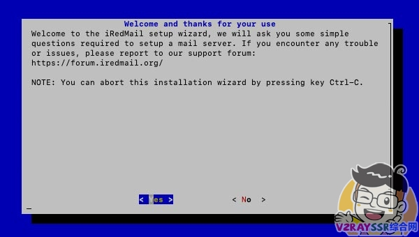

不安装，请按 Ctrl-C

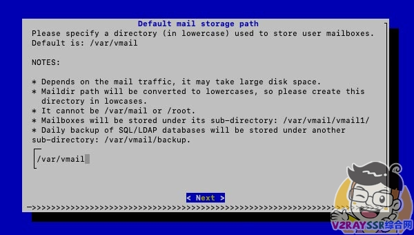

设置安装目录

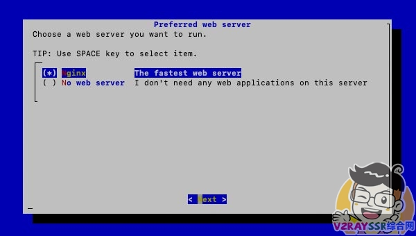

选择 web服务器

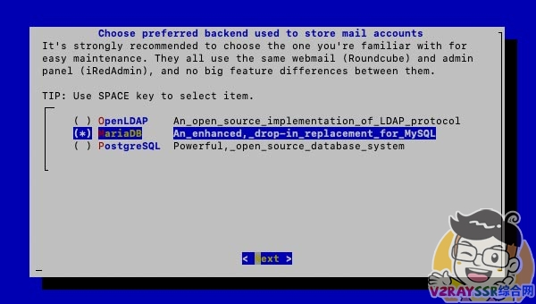

选择数据库类型

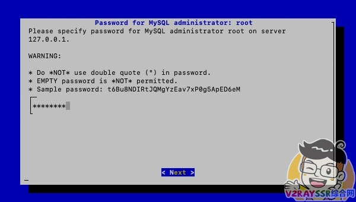

设置数据库密码

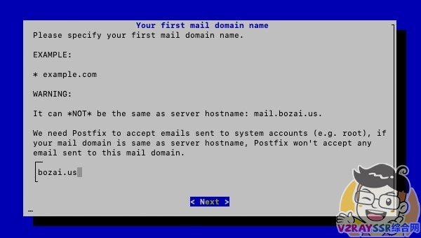

设置域，不可与 hostname 相同


设置管理员账号、密码

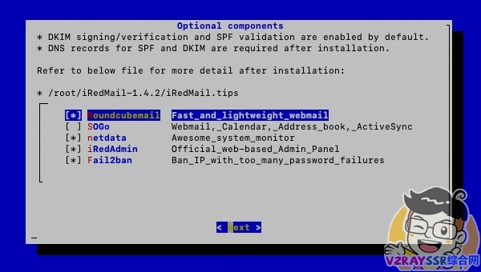

选择需要安装的组件


根据系统提示，一路输入 `y` 回车


**重启服务器，让邮件服务器生效！** 至此，邮件服务器搭建完毕，以下开始设置邮件服务器。

```
可以通过访问（当然，我们目前还没有解析域名，后面一起解析）https://你的域名/mail        ——邮件登录地址https://你的域名/netdata     ——服务器状态监控https://你的域名/iredadmin   ——邮件服务器后台管理 管理员账号：postmaster@你的域  例如 postmaster@163.com管理员密码：安装时候设置的密码以上信息，可以在 /root/iRedMail-1.4.2/iRedMail.tips 文件中查看
```

## 配置 iRedMail 邮件服务器

在申请证书之前，请完成 邮件服务器域名 的相关解析，我们规划的邮件服务器地址为 `mail.bozai.us` ，所以，申请证书之前，需要对把该域名指向 VPS IP。

### 申请证书

以下是 ACME 脚本申请证书，比较方便，若是证书申请上面有问题，请 [访问这里](https://v2rayssr.com/ssl.html)

（后续自己把证书移动、覆盖到 `/etc/pki/tls/private/iRedMail.key` 以及 `/etc/pki/tls/certs/iRedMail.crt` ）

为我们计划的邮件服务器域名 `mail.bozai.us` 申请证书，请自行替换命令行中的域名

```
curl https://get.acme.sh | sh~/.acme.sh/acme.sh --register-account -m xxxx@xxxx.com~/.acme.sh/acme.sh  --issue  -d mail.bozai.us  --webroot  /var/www/html~/.acme.sh/acme.sh --installcert -d mail.bozai.us --key-file /etc/pki/tls/private/iRedMail.key --fullchain-file /etc/pki/tls/certs/iRedMail.crt
```

### 重载服务

```
service postfix reload;service dovecot reload;service nginx reload
```

### 禁用 iRedMail 灰名单

找到 VPS 文件，`/opt/iredapd/settings.py`

```
plugins = ["reject_null_sender", "wblist_rdns", "reject_sender_login_mismatch", "greylisting", "throttle", "amavisd_wblist", "sql_alias_access_policy"]
```

将其中的 ”`greylisting `” 这项删去即可（注意对齐格式，不会请看 演示视频）

然后，重启 iredapd

```
service iredapd restart
```

## 配置域名 DNS 及解析

***以下内容，推荐观看 演示视频，然后根据需要，替换以下命令行中的相关命令。***

### 设置 PTR 反向解析

其他 VPS 商家，请自行查阅， 打开后台管理，在左边选项 `Mail contrlos` 里面，找到右边的 `PTR Records (Reverse DNS)`，点击 `set new record` 设置即可。


检测方式：`nslookup 8.8.8.8（服务器IP）`

### 设置 A 记录

将 `mail.bozai.us` 的 A 记录指向你的 VPS 服务器（邮件服务器）

检测方式：`nslookup mail.bozai.us`

### 设置 MX 记录

MX 记录就是邮件的解析记录，非常重要的一条记录，配置根域名的 MX 记录为自己的邮件域名地址，优先级为 10

检测方式：`nslookup -type=mx bozai.me`

### 设置 SPF 记录

SPF 记录是为了防止垃圾邮件而设定的，告知收件方，从设置的允许列表中发出的邮件都是合法的，设置方式为添加一条根域名的 TXT 解析记录

内容为 `v=spf1 mx ~all`

检测方式：`nslookup -type=txt bozai.us`

### 设置 DKIM记录

DKIM 可说是避免被判定为垃圾邮件的一大利器，DKIM 属于一种类似加密签名的解析记录，只有包含此加密数据，且公钥与密钥相匹配才属于合法邮件，要设置 DKIM 记录，首先要查询 DKIM 信息。

查询DKIM 信息有两种方式：

**第一种：**在系统中执行命令查看：`amavisd showkeys`

若是出现报错：`Config file "/etc/amavisd.conf" does not exist, at /usr/sbin/amavisd line`

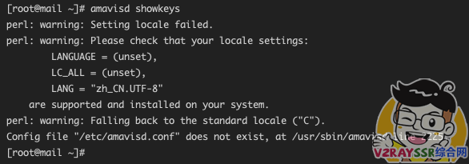

修改 `/usr/sbin/amavisd` 文件

搜索 `config_files = ( '`

把括号里面的路径改为 `‘/etc/amavisd/amavisd.conf’`

**第二种：**直接查看 `/root/iRedMail-1.4.2/iRedMail.tips` 文件，里面有相应的 DKIM

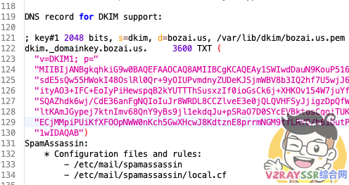

将括号内的文本 ***去除引号以及空格并相连*** 就是咱们的 DKIM 数据，在解析中添加一条 `dkim._domainkey` 的 TXT 解析，内容就是咱们组合出的文本

测试方式：`nslookup -type=txt dkim._domainkey.bozai.us`


### 设置 DMARC 记录

DMARC 记录是当收件方检测到伪造邮件等行为时，将根据您的配置进行操作的一个记录，比如拒绝邮件或放入垃圾邮件以及不做处理等，同时会反馈一份检测报告到配置的邮箱地址内。

添加方法就是增加一条 `_dmarc` 的 TXT 解析，内容为配置选项，`v=DMARC1; p=none; pct=100; rua=mailto:dmarc@bozai.us`

检测方式：`nslookup -type=txt _dmarc.bozai.us`

## 添加 iRedMail 用户

当然，你可以直接使用刚才系统创建的系统管理员邮箱，我们另外也可以增加邮箱用户

登录前，选择你的网页语言，其他就很简单了，如下图

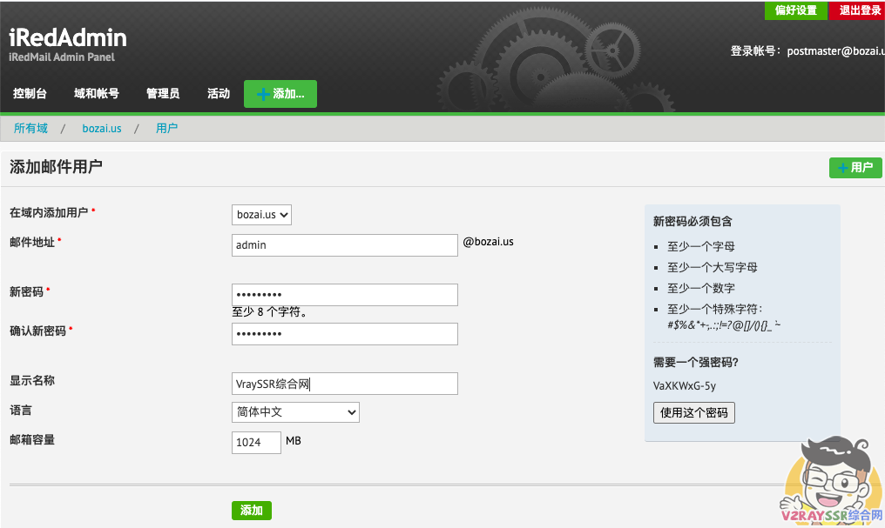

## 测试 iRedMail 邮件服务器

登录你的邮件服务器，里面的三封邮件是系统发过来的。

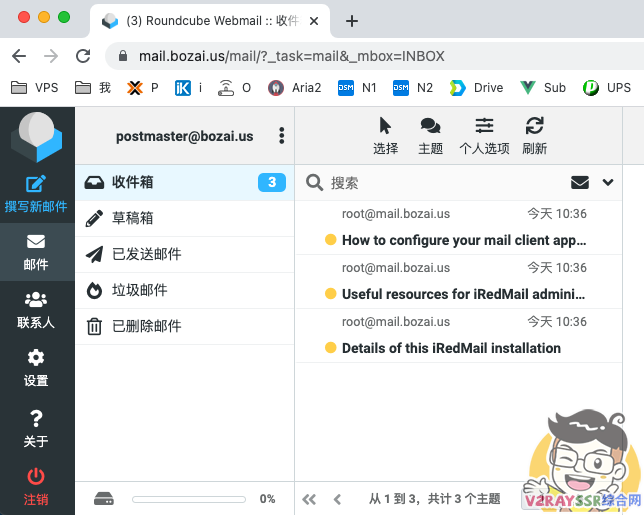

尝试用该邮件发送以及接收其他邮件的邮件，若是严格按照上面来配置，应该是一点问题都没有。

最后，我们访问 [https://www.mail-tester.com/](https://v2rayssr.com/go?url=https://www.mail-tester.com/)

按照网页上面给出的邮箱地址，我们用刚才搭建好的邮件服务器给这个地址发送一封邮件，然后点击测试。

***记住，该测试，每 24小时 ，只允许同个域测试三次，所以需要测试还是需要谨慎发邮件，别发垃圾！***

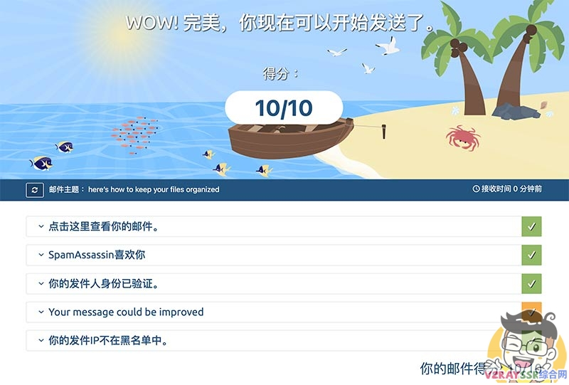

用刚才创建的用户，给 GMAIL 发一封邮件试试。

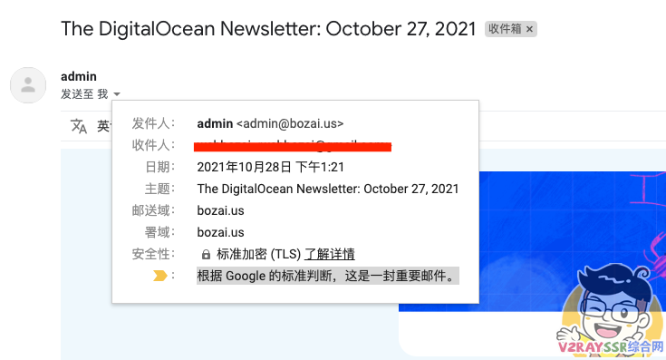

如果你是需要用其他客户端软件来收取或是发送邮件，端口列表在这里：

| 协议 | 地址     | 端口&加密端口 |
| ---- | -------- | ------------- |
| IAMP | 邮箱域名 | 143,993       |
| POP3 | 邮箱域名 | 110,995       |
| SMTP | 邮箱域名 | 25,587        |

我这边用的 “网易邮件大师”，可以完美的收发邮件，客户端如下配置：

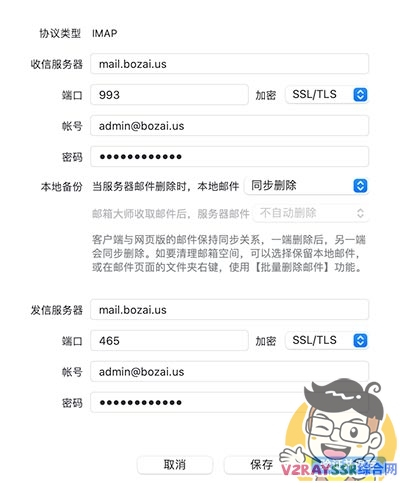

收发邮件完美！


## 后记

Perfect！`mail-tester` 测试10分！满分10！多棒的企业/个人邮件服务器，还担心会丢邮件吗？

其实有些人，觉得免费邮箱已经够用了，所以，此教程送给爱折腾、希望邮件自由的小伙伴们。