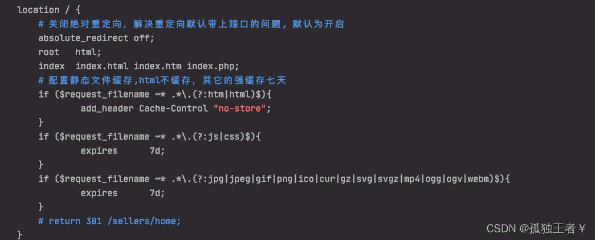
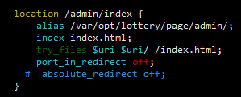
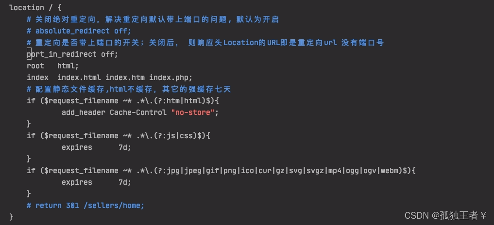

# 用Nginx做端口转发（反向代理）

有时我们会使用一些java或node应用，但又不想让他们直接监听80端口，这时就需要用到端口转发

本文中，我们介绍Nginx如何做端口转发，还有各种转发规则

## 将域名转发到本地端口

首先介绍最常用的，将域名转发到本地另一个端口上

```shell
server{
  listen 80;
  server_name  tomcat.shaochenfeng.com;
  index  index.php index.html index.htm;

  location / {
    proxy_pass  http://127.0.0.1:8080; # 转发规则
    proxy_set_header Host $proxy_host; # 修改转发请求头，让8080端口的应用可以受到真实的请求
    proxy_set_header X-Real-IP $remote_addr;
    proxy_set_header X-Forwarded-For $proxy_add_x_forwarded_for;
  }
}
```

这样访问 http://tomcat.shaochenfeng.com 时就会转发到本地的 8080 端口

## 将域名转发到另一个域名

```shell
server{
  listen 80;
  server_name  baidu.shaochenfeng.com;
  index  index.php index.html index.htm;

  location / {
    proxy_pass  http://www.baidu.com;
    proxy_set_header Host $proxy_host;
    proxy_set_header X-Real-IP $remote_addr;
    proxy_set_header X-Forwarded-For $proxy_add_x_forwarded_for;
  }
}
```

这样访问 http://baidu.shaochenfeng.com 时就会转发到 http://www.baidu.com

## 本地一个端口转发到另一个端口或另一个域名

```shell
server{
  listen 80;
  server_name 127.0.0.1; # 公网ip
  index  index.php index.html index.htm;

  location / {
    proxy_pass  http://127.0.0.1:8080; # 或 http://www.baidu.com
    proxy_set_header Host $proxy_host;
    proxy_set_header X-Real-IP $remote_addr;
    proxy_set_header X-Forwarded-For $proxy_add_x_forwarded_for;
  }
}
```

这样访问 http://127.0.0.1 时就会转发到本地的 8080 端口或 http://www.baidu.com

## 加 / 与不加 /

在配置proxy_pass代理转发时，如果后面的url加/，表示绝对根路径；如果没有/，表示相对路径

例如

1. 加 /

```
server_name shaochenfeng.com
location /data/ {
    proxy_pass http://127.0.0.1/;
}
```

访问 http://shaochenfeng.com/data/index.html 会转发到 http://127.0.0.1/index.html

不加 /

```
server_name shaochenfeng.com
location /data/ {
    proxy_pass http://127.0.0.1;
}
```

访问 http://shaochenfeng.com/data/index.html 会转发到 http://127.0.0.1/data/index.ht

## nginx解决多个端口映射80的配置

```
server {
    listen       80;
    server_name  xx.cn;  #域名1

    location / {
        proxy_pass http://x.x.x.x:9001;   #域名1需要映射到80端口的服务端口
    }

}

server {
     listen       80;
     server_name   xx.cn;   #域名2

     location / {
         proxy_pass http://xx.xx.xx.xx:7300;    #域名2需要映射到80端口的服务端口
     }

 }
```

### 注意:

**俩个server服务要相对独立，这样就可以同时将服务1和服务2的端口映射到80端口了**

# nginx 301重定向 设置

在nginx中配置，使得访问不带www的网址自动重定向到带www的域名。

## http协议的重定向

在[nginx官方文档](https://link.jianshu.com/?t=http://nginx.org/en/docs/http/converting_rewrite_rules.html)中有如下示例代码：

|      |      |      |      |      |      |      |
| ---- | ---- | ---- | ---- | ---- | ---- | ---- |
|      |      |      |      |      |      |      |
|      |      |      |      |      |      |      |
|      |      |      |      |      |      |      |
|      |      |      |      |      |      |      |
|      |      |      |      |      |      |      |


常见问题：

一、背景：

我们在访问nginx代理下的项目前端页面时，经常会有访问链接最末尾带不带'/'的问题，当我们访问http://xxxx/home时，如果匹配不到location，会自动加上端口port以及最末尾的'/'重定向到http://xxxx:port/home/。

二、问题描述：

在使用的过程中，其实我们很多时候不希望重定向后会带上端口号进行重定向，我们仅仅是希望加上末尾的'/'，因此引发了问题。

原因分析

1. 当访问的 uri 最后不带斜杠时，例如 http://localhost/product ，会先查找 product 文件，存在就返回；若存在 product 文件夹，会在末尾加上一个斜杠并产生 301 跳转。
2. 当访问的 uri 最后带斜杠时，例如 http://localhost/product/，查找 product 下的 index 页面，存在就返回；不存在且未开启自动索引目录选项（autoindex on）则报 403 错误。

在第一种情况，访问带目录的 url 时，如果末尾不加斜杠("/")，nginx 默认会加上斜杠，发生一次 301 跳转，但这个默认行为在 nginx 前端有 LB 负载均衡器、且 LB 监听的端口与 nginx server 监听的端口不同时会导致访问出错。


三、解决方案：

经过查找，找到了如下两个配置：

1、absolute_redirect：

绝对重定向开关，默认为开启；关闭后，则响应头Location的URL即是重定向url 没有域名（IP）和端口号, 而是直接采用相对路径进行重定向，如下：

​      开启时，http://xxxx/home会重定向到http://xxxx:port/home/

  	关闭后，http://xxxx/home请求的响应头Location的变成了相对路径/home/

修改nginx配置如下，如下，经验证，问题解决。





 2、port_in_redirect：

​       重定向是否带上端口的开关；关闭后， 则响应头Location的URL即是重定向url 没有端口号

​       修改nginx配置如下，经验证，问题也能解决：


