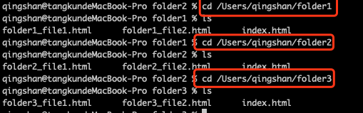

# 背景

nginx是一款高性能的服务器，用途很多。除了可以作为后端服务的负载均衡反向代理服务器，还有一个用途就是做静态资源的缓存服务器。

当前项目基本上都是前后端分离，为了加速前端页面的响应速度，可以将前端的相关资源，如html，js，css或者图片放到nginx指定目录下。访问的时候只需要IP加路径就可以实现高效快速的访问。 

# 正文

一.首先安装好nginx,启动nginx服务且能够正常访问 Welcome to nginx!界面

二.配置静态资源访问核心是配置nginx.conf文件，找到nginx.conf文件

三.配置nginx.conf

　3.1.在nginx.conf的http节点中添加配置，参考下方格式：

```
    server {
        listen       8000;
        listen       somename:8080;
        server_name  somename  alias  another.alias;

        location / {
            root   html;
            index  index.html index.htm;
        }
    }
```

　　3.2 解读server节点各参数含义

　　　　listen：代表nginx要监听的端口

　　　　server_name:代表nginx要监听的域名

　　　　location ：nginx拦截路径的匹配规则

　　　　location块：location块里面表示已匹配请求需要进行的操作

　　　　

四.实例

　　　　4.1准备要访问的静态文件

　　　　　　两个文件夹：folder1 folder2 folder3各放两个文件一个index.html 

 [](https://img2020.cnblogs.com/blog/1238609/202004/1238609-20200430173513232-217657252.png)

　　　　4.2创建一个server

```
    server {
        listen       9999;
        server_name  localhost;

        location /xixi {
            alias   /Users/qingshan/folder1;
            index  index.html;
        }

        location /haha {
            alias   /Users/qingshan/folder2;
            index  index.html;
        }

        location /folder3 {
            root   /Users/qingshan;
            index  index.html;
        }
    }
```


 [](https://img2020.cnblogs.com/blog/1238609/202004/1238609-20200430162047114-1726912757.png)[](https://img2020.cnblogs.com/blog/1238609/202004/1238609-20200430162104429-1111596185.png)[](https://img2020.cnblogs.com/blog/1238609/202004/1238609-20200430162117497-897049993.png)

 [](https://img2020.cnblogs.com/blog/1238609/202004/1238609-20200430162142484-399085031.png)[](https://img2020.cnblogs.com/blog/1238609/202004/1238609-20200430162236081-643074089.png)[](https://img2020.cnblogs.com/blog/1238609/202004/1238609-20200430162300734-1363580702.png)

[](https://img2020.cnblogs.com/blog/1238609/202004/1238609-20200430173547992-718510990.png)[](https://img2020.cnblogs.com/blog/1238609/202004/1238609-20200430173608469-1780585424.png)[](https://img2020.cnblogs.com/blog/1238609/202004/1238609-20200430173725250-304929493.png)

 

 五.重点

　　重点是理解alias与root的区别，root与alias主要区别在于nginx如何解释location后面的uri，这使两者分别以不同的方式将请求映射到服务器文件上。

　　alias（别名）是一个目录别名。

```
　　　　例子：

　　　　　　location /123/abc/ {
　　　　　　　　root /ABC;
　　　　　　}
　　　　　　当请求http://qingshan.com/123/abc/logo.png时，会返回 /ABC/123/abc/logo.png文件，即用/ABC 加上 /123/abc。
```

　　root（根目录）是最上层目录的定义。

```shell
# 例子：
  location /123/abc/ {
    alias /ABC;
  }
  # 当请求http://qingshan.com/123/abc/logo.png时，会返回 /ABC/logo.png文件，即用/ABC替换 /123/abc。
```

　　　

### 六、访问某个文件

 通过nginx访问静态文件配置，均是在server模块中配置，有两种方式：

1、alias

通过alias关键字，重定义路径，如

server{
    listen 7001;
    server_name 127.0.0.1;
    location /file/ {
        alias /home/china/areas/;
    }
}

此时，通过浏览器访问http://127.0.0.1:7001/file/t.txt，则访问服务器的文件是/home/china/areas/t.txt

2、root

通过root关键字，重定义路径，如

server{
    listen 7002;
    server_name 127.0.0.1;
    location / {
        root /home/china/areas/;
    }
}

此时，通过浏览器访问http://127.0.0.1:7001/t.txt，则访问服务器的文件是/home/china/areas/t.txt

上述两种方法均可达到目的，区别是它们对路径的解析方式不同，alas会把指定路径当作文件路径，

而root会把指定路径接到文件路径，再进行访问。